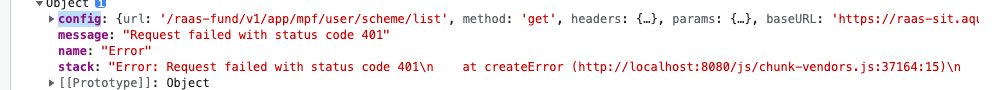
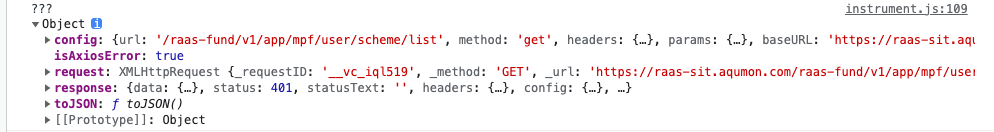
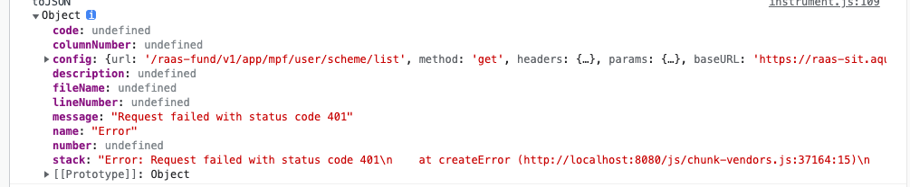

## 返回状态码为0

当请求的状态码为0时，表示当前游览器是没有拿到服务器响应。

没拿到服务器响应，无法从响应中解析响应的状态码，因此可以认为没拿到响应的请求状态码统一为0.

### 出现场景

1. 网络请求超时：请求发出到指定的超时时间内，游览器没有接收到服务器返回的响应
2. 跨域：请求跨域了，如果没有配置cors，游览器也不会将请求的响应返回给用户程序，此时也是拿不到响应的。
3. 网络错误：当前你的网络有问题

### 错误对象字段

axios 请求失败时会返回一个Error对象，包含一下字段：

#### config

请求配置项，有时可以在请求中自定义字段，在请求/响应拦截器进行使用。

#### message

错误消息

#### name

错误名称

#### stack

错误追踪栈

#### request

当前请求实例

#### responese

服务器返回响应，当状态码为0时，response是不存在的为null。

#### toJSON

axios 提供的用来打印出更多错误信息

#### 更多字段

因为Error对象不能直接打印，打印出来是一个错误文本因此采用以下几种方法进行尝试

#### 1、JSON.parse(JSON.stringify(xxx))

#### 2、{...xxx}

#### 3、toJSON

至于1和2打印的不同待研究

查看 **js 下的 JSON 和 展开运算符 (2023/4/23)**

### 错误处理

1、返回response时，可以分为真实的请求错误和业务报错，按照自己的要求进行处理

2、没有返回response时，可以使用Error返回的message拿到请求失败的原因，常见的有**Network Error** 和 ** timeout ... ** 可以按照要求统一处理还是单独处理。
