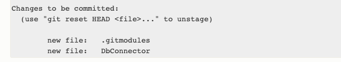
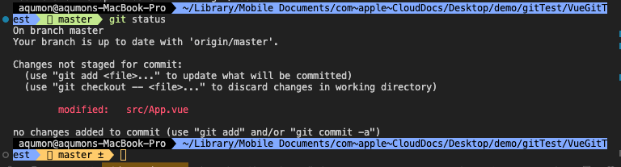

## 添加子模块

```
git submodule add <project url> [path]
```

**project url**：项目仓库地址

**path**：子模块存放的路径

执行以上命令创建子模块，默认会在当前目录下创建一个与子模块仓库同名的目录，如果想将子模块放在其他目录下，需要指定path。

### 行为

1、在**.gitmodules**配置文件下添加一条子模块记录，如下


2、初始化本地git配置，在**.git/config**文件中同步一条子模块信息


3、更新子模块，拉取远程仓库并将子模块检出到指定提交

因此，这时使用git status，就可以看到有两个修改需要提交



.gitmodules是需要被提交的，所以其他用户才知道该项目所拥有哪些子模块以及这些子模块的仓库url。

## 克隆含有子模块的项目

当使用git clone命令克隆某个项目时，**默认情况下是不会克隆子模块的**，所以子模块目录是一个空目录


在看下.git目录的初始状态


本地配置文件 **.git/config**


主项目的**.gitmodules**


### 子模块初始化

```
git submodule init
```

使用以上命令进行子模块的初始化，该命令会将.gitmodules中的子模块信息同步到本地的config文件中，也就是在本地进行子模块的初始化。

**.git/config**加上了子模块的相关配置


### 更新子模块

```
git submodule update
```

该命令会读取本地git配置文件，获取相应的子模块信息，拉取远程仓库并将子模块检出到指定的提交。


此时**.git**目录下多了**modules**目录，表示项目子模块


但是如果在克隆了主项目后，没有使用init对本地子模块进行初始化，那么使用update进行更新，是无法更新子模块的。

<br/>

```
git submodule update --init
```

该命令是init和update命令的合成，使用以上命令也能达到两个命令使用的结果。

因此完整的流程

```
git clone <main-project>

git submodule init
git submodule update

or

git submodule update --init
```

或者在克隆主项目同时完成子模块的初始化和更新，使用以下命令

```
git clone --recurse-submodules <main-project>
```

使用**--recurse-submodules**选项，它就会自动初始化并更新仓库中的每一个子模块， 包括可能存在的嵌套子模块。


## 子模块修改

当子模块做了修改后，在主项目中也会生成对应的子模块修改。

子模块打印status



主模块打印status


主模块status打印会显示出哪个子模块发生了修改。

### 当子模块修改提交后

子模块status打印


主模块status打印


主模块status打印表示子模块有了新的提交，我们要将新的子模块提交记录提交到仓库，然后push到远程仓库。


这里就是submodule update命令执行时，子模块需要检出的那个提交。

## 参考

[git 子模块](https://git-scm.com/book/zh/v2/Git-%E5%B7%A5%E5%85%B7-%E5%AD%90%E6%A8%A1%E5%9D%97)
