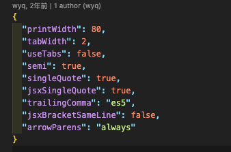

## prettier 基本配置使用

### 介绍

prettier 是一个代码格式化工具，它会读取你的代码，并按照指定规则重写代码，用来保证代码风格。

eslint 是代码质量检查工具，它也会读取代码，并按照配置的规则检查代码，判断代码是否严谨和存在漏洞，用来保证代码规范。

在多人协作开发项目时，使用prettier和selint可以统一大家的代码风格和规范。

### 使用

目前使用的开发工具是vscode

1、安装prettier 插件

2、在vscode 配置中打开 **文件保存即格式化**

打开后，可以看到配置文件多了一条"editor.formatOnSave": true,

目前安装了prettier插件，并打开了文件保存即格式化的配置，但是还需要告诉vscode保存时需要使用的格式化工具，不然vscode也不知道你要使用prettier进行格式化。

3、将prettier配置为默认的格式化工具

打开后可以看到

然后选择prettier为默认值就行。

目前是不同的文件类型都需要显示指定格式化的默认值为prettier。

如果保存后发现没格式化可以查看下当前的默认值是否为prettier。

4、prettier的配置文件

**.prettierrc** 为prettier的配置文件，用来配置代码格式化的规则。

例如：tabWidth: 2表示tab缩进两个空格，如果为4表示缩进4个空格。

当我们保存某个文件时，它会从当前文件所在目录开始查找prettier的配置文件，没找到则会向上层目录查找，直到找到或者到文件根目录为止，没找到则使用默认配置。

**.prettierignore** 为prettier格式化的忽略文件

当我们使用 **prettier write '\*\*/\*'** 统一格式化某些目录或者文件时，我们希望其中的一些文件或者目录不需要进行格式化，就可以采用.prettierignore去配置忽略文件。

## 参考链接

1. [官网](https://prettier.io/docs/en/index.html)