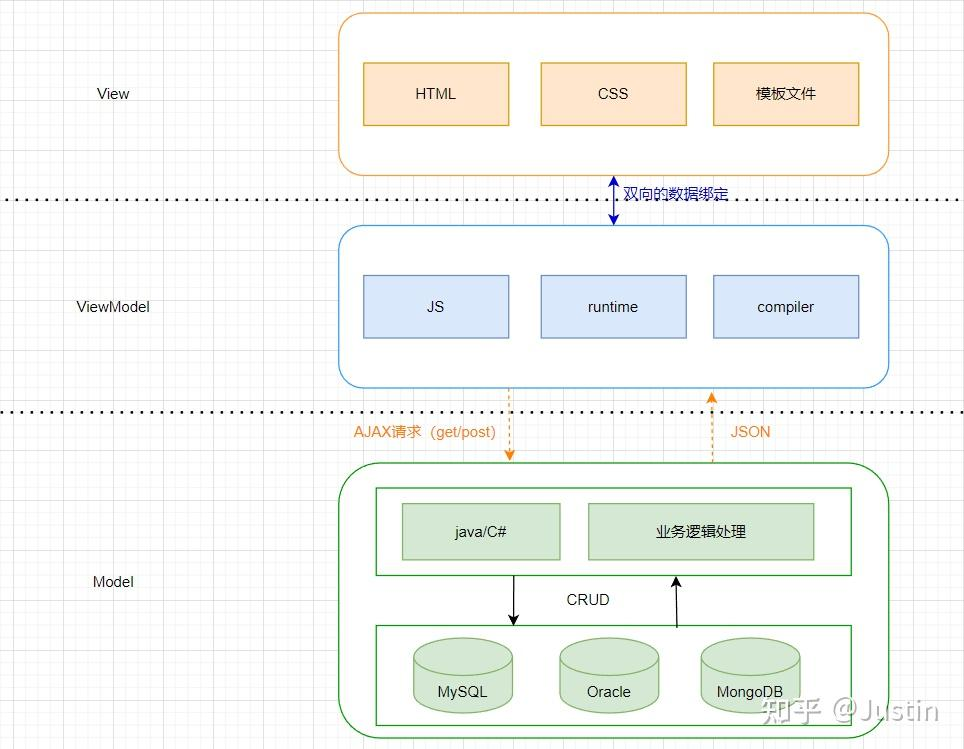

## VUE - MVVM

**Model-View-ViewModel（MVVM）**是一种软件架构的设计模式。

它分为三层：

**View**

View是**视图层**，表示用户界面，展示用户数据，跟用户进行交互。

**ViewModel**

ViewModel是MVVM的核心，表示**视图模型**，它跟View进行**双向数据绑定**，与Model层进行数据交互。

视图模型意味着它是对视图的一个描述，包括视图的状态以及行为。

因此View展示的数据是ViewModel的数据，View中的交互行为也在该层进行描述。

而ViewModel中的数据是来自Model层，经过二次处理封装后，生成符合View层预期视图数据模型。

View层和ViewModel层双向数据绑定，当ViewModel中的数据更新时能自动更新View，用户在View层进行交互时可以更新ViewModel中的数据。

而Vue扮演的是ViewModel角色，在官方实例中也可以看到Vue实例变量名称都是vm。

**Data Bindings**：对View中展示的数据进行绑定，当数据变化时更新View。

**DOM Listeners**：事件监听，当事件触发后，允许更新数据。

**Model**

Model表示数据模型，泛指后端进行的各种业务逻辑处理和数据操控，主要围绕数据库展开。

MVVM是数据驱动模型，当数据发生变化后自动更新DOM，而自动更新DOM的行为是由MVVM框架进行处理的，这样我们才可以更加专注于业务的开发。

## 参考：

[维基百科 MVVM](https://zh.wikipedia.org/wiki/MVVM)

[MVVM](https://www.zhihu.com/question/311967891)
