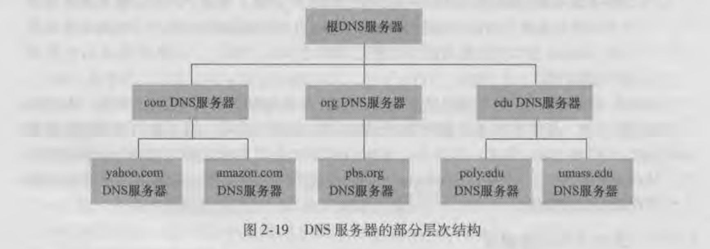
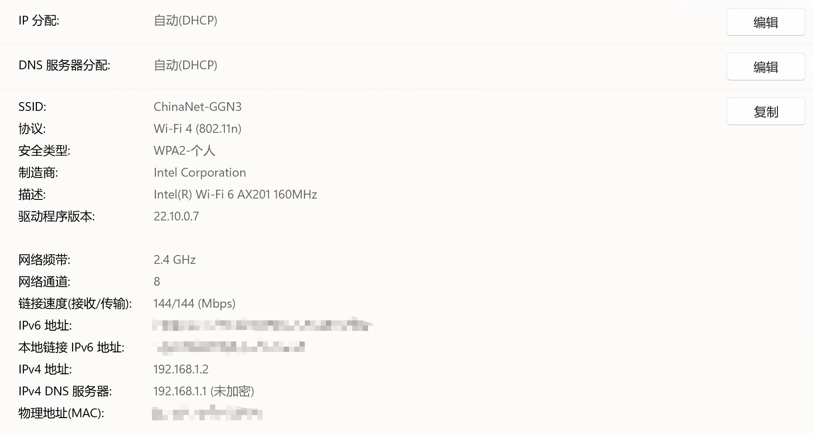
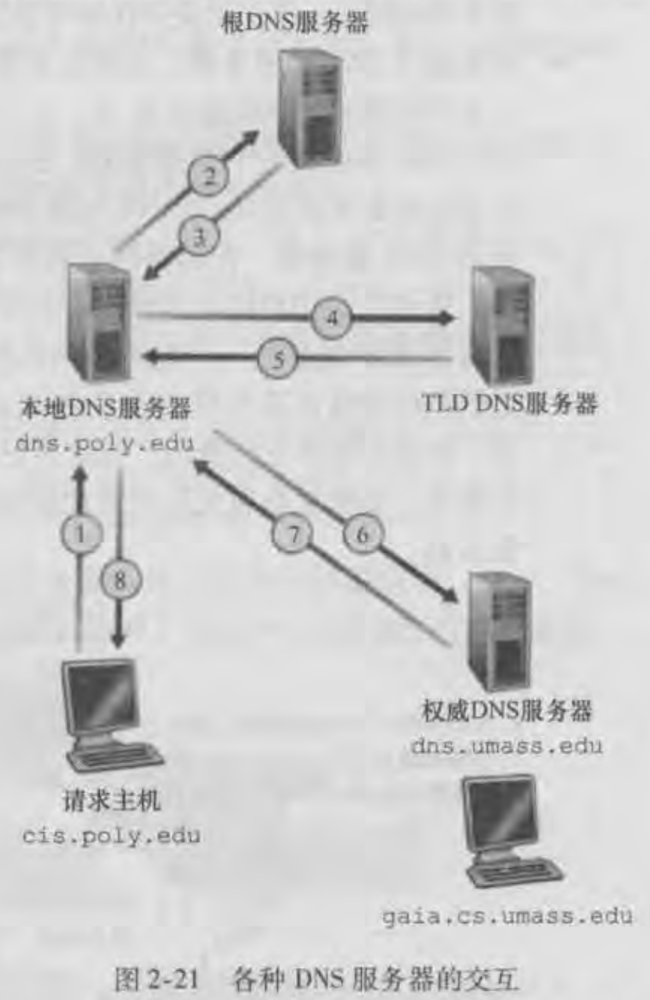
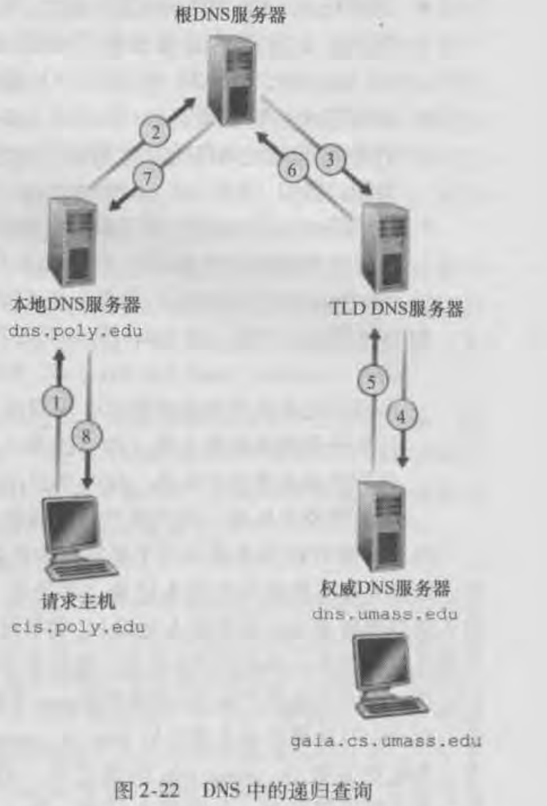

# Domain Name System DNS

## 简介

互联网的主机有两种标识：主机名和IP地址

主机名优点在于方便人们记忆且人们乐于接受，有意义。缺点在于因为主机名是不定长的，导致路由器难以解析和管理，无法定位主机在互联网中的位置。

IP地址优点在于定长32二进制位，便于路由器处理。缺点在于对人们来说没有任何意义且不便记忆。

所以为了折中就需要一个系统做主机名到IP地址的转换，这个系统就是DNS。

在应用层上使用的是域名，但是传递给下层的是经过DNS解析的IP地址。

## DNS 用途

1. 主要用途在于**主机名到IP地址的转换**
2. **主机别名**：主机除了主机名外，还可以拥有一个或者多个主机别名，就像人一样除了自己的名字外，可能还存在多个昵称。主机别名的好处在于相对于主机名，主机别名更有意义且好记。例如一台relay1.west-coast.enterprice.con的主机，可能还有两个别名enter-price.com和`www.enterprice.com`。这时主机名也被称为**规范主机名**，DNS提供主机别名到主机名转换。
3. **邮件服务器别名**：与主机别名一样，可以给邮件主机名取别名，DNS也提供邮件主机别名到邮件主机名的转换
4. **负载均衡**：DNS也用在冗余服务器之间进行负载均衡，可能一个服务部署在了多台服务器上，每个服务器都有自己的IP地址。那么意味着一个主机名可能映射多个IP地址，DNS数据库中存储着这些IP地址集合。当客户端发起DNS请求时，DNS会将该主机名对应的IP地址集合进行响应，但是每次DNS会对返回的IP地址集合的次序进行循环。因为客户端总是向IP地址集合中第一个IP地址发送请求，所以能做到一个负载均衡的效果。但是可能一些公司会通过DNS做更加复杂的负载均衡效果。

## DNS 工作原理概述

### DNS 服务器设计

DNS 的一种简单设计是在因特网上只使用一台服务器，这台服务器包含了所有的主机名到IP地址的映射记录。

这种集中式设计存在的问题在于：

1. 单点故障：该DNS服务器挂了，整个网络也就挂了
2. 通信容量：全球所有主机DNS查询请求都会发往这台主机
3. 远距离的集中式数据库：单个服务器是不可能临近所有用户的
4. 维护：所有更新都在一台服务器上，难以维护和扩展

因此DNS 服务器设计采用的是另一种方案：分层次的分布式

DNS使用了大量的DNS服务器，它们以**层次方式组织、分布在全球范围内**。

DNS服务器的分类：**根DNS服务器、顶级域（TLD）DNS服务器、权威DNS服务器**

这些类型的服务器以下图所以的层次组织起来。

**根DNS服务器**：在全球有13个根DNS服务器（IPv4），标号A到M。我们说的一个根DNS服务器实际上是一个冗余的服务器群，以保证可靠性和安全性。

根DNS服务器记录的是下层顶级域DNS服务器所在的位置，例如com，根DNS服务器返回就是com顶级域DNS服务器的IP集。

**顶级域（TLD）DNS服务器**：记录的是下层DNS服务器的IP集

**权威DNS服务器：**记录该组织或机构所有因特网可访问主机的主机名到IP地址映射的DNS记录。权威的概念是相对的，例如一个大学有一台DNS服务器，记录了本大学内所有的域名到IP地址映射的记录。对于其他想访问大学内的主机来说，大学的那台DNS服务器就是权威的，因为那是大学维护的。但是如果大学内的每一个系都有自己的DNS服务器，那么每一个系的DNS服务器才是权威服务器，而不是大学提供的DNS服务器。而大学DNS服务器可以认为是中间DNS服务器，记录了每一个系DNS服务器所在的位置。总结来说：权威服务器就是能直接提供域名到IP地址映射的DNS服务器。

可以看出DNS查询都是一层一层往下查询的。

除了以上DNS服务器外，还存在一个重要的DNS服务器，称为**本地DNS服务器**。本地DNS服务器严格意义上来说不属于DNS服务器层次结构。因为它主要作用是代理，代理客户端去查询DNS以及缓存。

当我们使用某个ISP提供的网络服务时，默认情况下（DHCP）都会指定一台或者多台本地DNS服务器的IP地址。而这些DNS服务器一般会跟你的主机在同一个局域网中，可以打开网络设置进行查看，如下：

IP和DNS都采用DHCP进行默认分配，可以看出网关就是本地的DNS服务器。

使用本地DNS服务器的好处在于：

1. 缓存：当一个域名解析记录存在与本地DNS服务器时，那么指定了相同的本地DNS服务器的其他主机想要访问相同域名时就可以直接读取缓存。
2. 代理的好处在于可以做很多额外的事情，例如拦截等等。

### DNS 查询

DNS查询可以分为**递归查询和迭代查询**

**迭代查询：**

1. 首先主机（cis.poly.edu）想要获取某个主机名（gala.cs.umass.edu）对应的IP，它会将DNS请求发送到本地DNS服务器上
2. 本地DNS服务器先查看自己是否缓存相对应主机名的IP，如果有则直接返回给请求主机，没有则请求根DNS服务器
3. 根DNS服务器会查询edu这个顶级域名所对应的IP集，并返回给本地DNS服务器
4. 本地DNS服务器则会去请求edu顶级DNS服务器
5. edu顶级域名服务器则会去查询umass.edu前缀，将对应DNS服务器的IP集返回。
6. 本地DNS服务器一直迭代的去请求其他DNS服务器，直到拿到想要的主机名所对应的IP。
7. 然后缓存，并将IP返回给客户端。

迭代查询请求实体一直都是本地的DNS服务器

**递归查询：**

递归查询的请求实体就是一直变化的

## 参考

[顶级域名列表](https://www.iana.org/domains/root/db)

