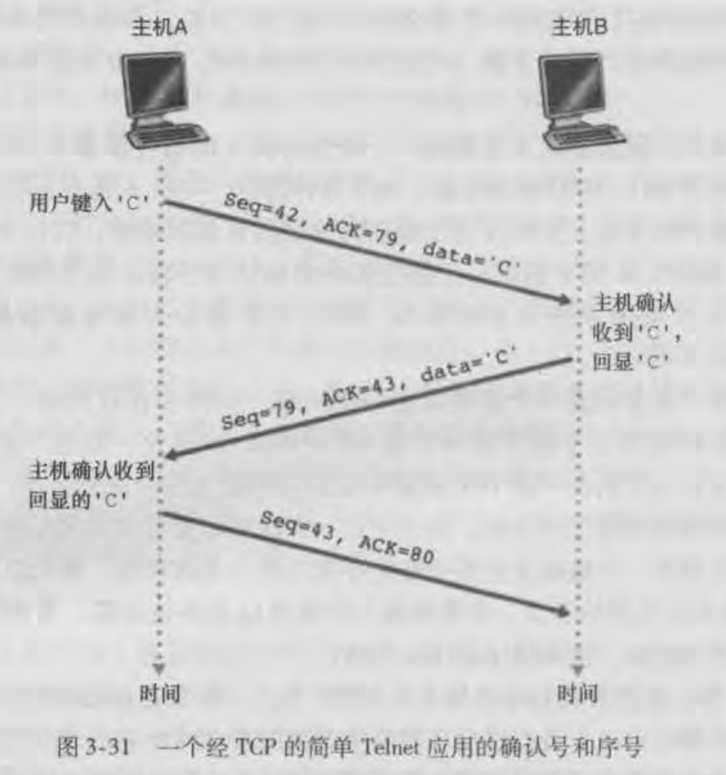
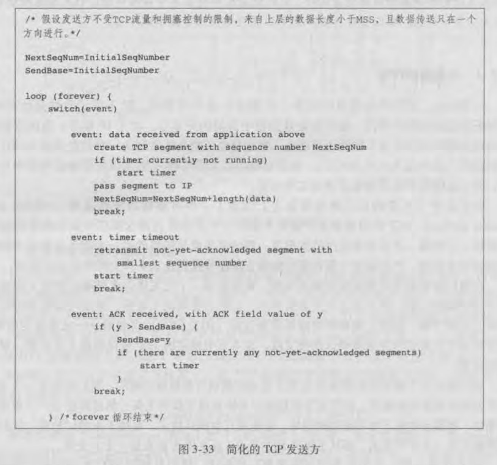
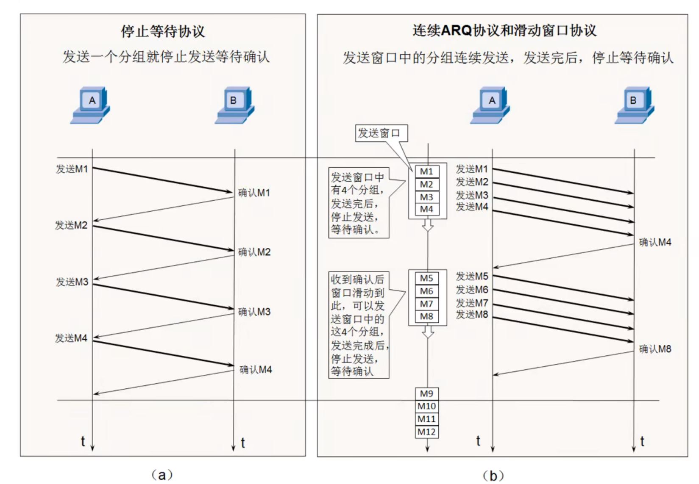
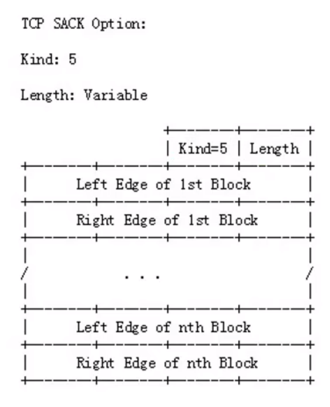
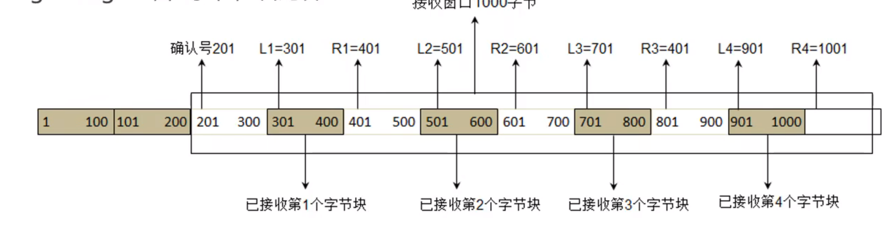

# TCP-可靠数据传输

首先IP协议提供的是不可靠的服务。

从数据完整性的角度出发在IP协议首部字段有一个首部校验和，而这个校验和只对首部字段进行校验不包括数据部分，所以数据的完整性是不保障的。

其次IP协议也没有确认机制，也就是说发送方不会知道发送的数据包是否被正确接收到，更没有重传机制。

以上总结就是IP协议是不可靠的，不保证数据的交付也不保证数据的按序交付、不保证数据的完整性。

因此TCP要基于IP不可靠服务之上创建一个**可靠的数据传输服务**

TCP的可靠数据传输服务确保一个进程从接收缓存中读取的数据流是无损坏、无间隔、非冗余和按序的数据流，即与连接的另一端发送的数据流是完全相同的。

如下图：

## 可靠传输的几大要素

TCP可靠数据传输使用的是**流水线**的形式，但是它不是GBN和SR协议中的一种而是两种协议的混合体。

首先需要知道的是TCP是**面向字节流**的，因为需要确保的是每一个字节都能被正确的传输，因此TCP中的序号和确认号也是面向字节的。

实现可靠数据传输的几大因素在TCP中的含义：

**序号**：逻辑上TCP会对传输的字节流中的每一个字节进行编号，而报文段中的序号就是**报文段中数据部分第一个字节的编号**

**确认**：TCP采用的是**累积确认**，在TCP中通过ack标志位与确认号进行体现，当ack标志位设为1表示是一个ack报文，确认号字段才有效。

**确认号**：假设返回的ack报文中确认号为n，则表示序号在n之前不包括n的所有字节都已经被正确接收，并期待接收的下一个字节的序号为n。

**定时器**：TCP采用**单一定时器**，可以认为是对最早未确认报文段的定时器。而定时器的超时时间是动态计算的，通过对平均的往返时间（RTT）和4倍平均差进行计算得到的。

**超时重传**：超时后，在TCP中只会**重传最早未确认的报文段**，只会重传一个而不会重传所有未确认的报文段。而且只会**使用超时重传来恢复报文段的丢失**。

**滑动窗口**：窗口大小也是面向字节的，发送窗口决定了未确认字节流的序号范围。接收窗口则决定接收的字节流的序号范围。

## 可靠传输过程

**一个简单的TCP传输过程：**

1. 主机A发送一个报文段，它的序号是42，数据部分只有一个字符C。
2. 主机B收到后会返回对该报文段的确认，确认号为43，表示42及小于42序号的所有字节都已经被正确接收到，希望接收的下一个序号是43。
3. 所以主机A返回给主机B的确认中序号为43。并且确认号为80，对79的一个确认。
4. 之所以是43和80，因为数据部分只有一个字符C，只占一个字节。并且通信双方都可以作为发送方和接收方，所以双方都需要维持自己的一个序号。

上面只是一个简单的TCP传输过程，用来对序号和确认号进行描述。

**下面是简化的TCP发送方伪代码：**

1. 首先给nextseqnum和sendbase变量赋值为一个初始的序号（在建立连接时所生成的一个随机数）
2. 发送方有三个事件：来自上层的调用、超时、收到确认。
3. 来自上层的调用后会将数据打包成一个报文段，该报文段的序号是nextseqnum，并向下传递发送给对方。判断当前是否有定时器正在运行，没有则启动一个定时器。然后修改nextseqnum的值，加上发送的报文段的长度来表示下一个发送的报文段的序号。
4. 如果定时器超时，则会重传最早未确认的报文段，而不是重传所有的未确认的报文段，然后重启定时器。
5. 如果收到了ACK，判断确认号y是否大于sendbase，大于则sendbase前移到y值。在sendbase之前的字节都是确认已经收到的字节数据。然后判断是否还有未确认的报文段（sendbase == nextseqnum），如果有重启定时器，没有则关闭定时器。

### 连续ARQ协议 + 滑动窗口协议

### 选择性确认 - SACK

SACK（Selective Acknowledgement）选择性确认

可以告诉发送方未按序到达的哪些数据是已经确认收到的，那些是丢失的。

SACK信息会放在TCP首部的可变部分。

Kind：占一个字节，值为5表示这是SACK选项

Length：占一个字节，表示SACK选项总共需要占用多少字节

Left Edge：占四个字节，左边界

Right Edge：占四个字节，右边界

首先确认号201，表示前面200个字节已经确认收到

SACK选项信息：

第一对左边界值（L1）为301，右边界（R1）值为401，表示301到 400（右边减1）这一块是确认收到的，不需要在重新传。

以此类推。

一对边界信息需要占用八个字节，还有两个固定字节。但是可变部分最大四十个字节

所以(40 - 2) / 8 = 4，最多能存取4对边界信息。