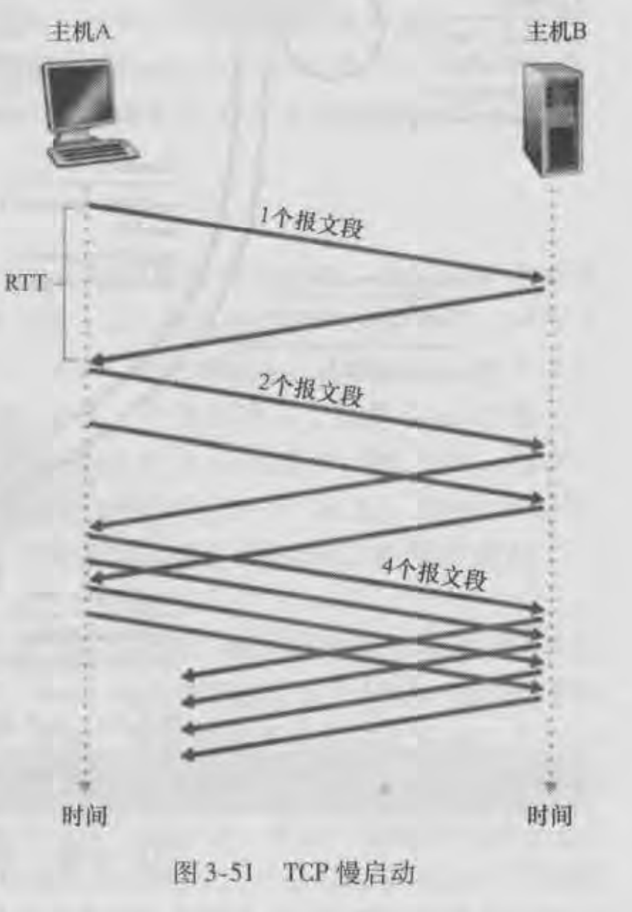
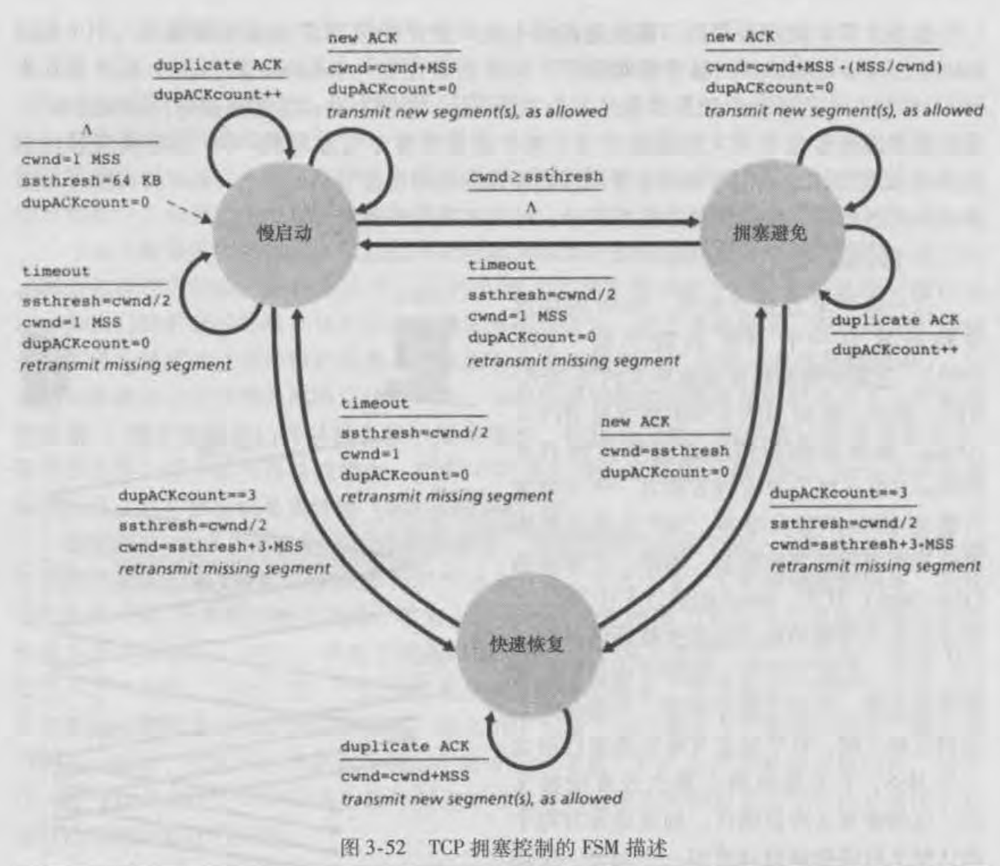

## TCP - 拥塞控制

TCP流量控制针对的是通信的双方，而拥塞控制针对的是通信双方之间的网络。

本质上都是对发送方的控制，避免发送过多的报文段到接收方和网络中。

但是拥塞控制无法避免网络拥塞，只能在网络出现拥塞征兆后，采取措施减轻网络拥塞。

流量控制是可以通过接收方的接收窗口大小控制发送方的发送速率。但是发送方无法从网络中获取拥塞窗口的信息，来得知发送方应该发送多少才不会引起网络拥塞，网络是共享的。

### 拥塞原因与结果简单概述

假设两台主机（主机A和B）通信，主机A向主机B发送一个分组，经过一个路由器后传输给了主机B。

当主机A向主机B发送十个分组，那么这十个分组需要在路由器缓存中排队，依次被路由器进行转发到主机B中。单个分组达到主机B的时延就跟其在路由器排队的时长相关，排队的分组越多，时延就越大。

当到达路由器的分组数超过了缓存大小，就会被丢弃（丢包），这时就是发生了堵塞。

在实际情况中网络是共享的，一个路由器可能接收多个终端的数据包，当多个终端的数据包同时到达时。这时路由器的接收速率是大于其发送速率，也就是为什么路由器需要缓存的原因。

多个不同的数据包需要在缓存中排队等待处理，那么到达目的主机的平均时延就变大了对于不同的通信双方。

当超过了路由器缓存大小时，可能存在多个终端的数据包被丢弃，假设没有拥塞控制那么这些终端会重传这些数据包，如果还有一些新的终端会传递新的数据包到路由器中，可以想象通信的效率是多么的低下。

所以拥塞的最直观的感受就是**通信效率低下（卡顿），对于主机来说最直观的感受就是丢包。**

### 拥塞控制原理

#### 拥塞控制所要解决的三个问题：

1. 怎么限制发送方的发送速率
2. 发送方怎么感知到目的主机路径是否拥塞
3. 当发生拥塞或者一切顺利时怎么调节发送速率

**怎么限制发送方的发送速率**

在发送方需要维持一个新变量：拥塞窗口`cwnd`，通过该变量限制发送方的发送速率。它应该满足以下公式
$$
LastByteSent - LastByteAcked <= min(cwnd,rwnd)
$$
发送方已发送但未确认的字节数应当满足小于等于接收窗口和拥塞窗口的最小值。

当`rwnd`足够大时，发送方的发送速率就有`cwnd`决定。

所以通过拥塞窗口对发送速率进行限制。

**发送方怎么感知到目的主机路径是否拥塞**

TCP中没有一个显示的指标用来指定网络一定发生了拥塞。

而是当发生了丢包事件（**要么超时，要么收到了三次冗余ACK**）后，发送方会隐式的认为网络发生了拥塞。

而当发送方接收到了对未确认报文段的ACK时，它会认为当前网络是顺畅的。

**当发生拥塞或者一切顺利时怎么调节发送速率**

简单来说就是怎么调节`cwnd`的值，保证不会因发送速率太大而导致网络拥塞，也不会因为发送的速率太小而浪费网络带宽。

TCP给出了以下指导性原则：

1. 一个丢失的报文段意味着拥塞，因此当丢失报文段时应当降低发送方的发送速率，减小`cwnd`的值
2. 一个对未确认报文段的ACK意味着网络是顺畅，应当增加发送速率，加大`cwnd`的值
3. 宽带探测，探测发生拥塞的开始速率，收到一个ACK就增加一次发送速率直到发生拥塞后开始降低速率，然后正常后又开始增加速率，一直探测发生拥塞的开始速率。

#### 拥塞控制算法 - Reno

拥塞控制算法主要由三部分组成：**慢启动、拥塞避免、快速恢复**

慢启动和拥塞避免是TCP的强制部分，而快速恢复是推荐部分是非必须的

##### 慢启动

当TCP建立连接时，拥塞窗口的值通常会被初始化为一个`MSS`较小的值。

所以初始化后，通常发送方只会发送一个报文段到接收方，当返回一个`ACK`确认后拥塞窗口的大小增加一个`MSS`。

那么发送方就可以发送两个报文段，当两个报文段的`ACK`返回时，每一个确认都会给拥塞窗口增加一个`MSS`，所以拥塞窗口的大小为4个`MSS`，下次就可以发送四个报文段。

可以看出在慢启动状态，拥塞窗口的大小每经过一轮它的值就会变为原来的两倍，成**指数增长**。如下图：

拥塞窗口不可能一直呈指数形式增加，所以在某些事件下TCP会退出慢启动状态

1. 在发送方另外维持了一个状态变量`ssthresh`（慢启动阈值），它的值是`cwnd`的一半。当拥塞窗口的值达到或者超过慢启动阈值时，就会退出慢启动状态，进入拥塞避免状态
2. 发送方收到三个冗余的`ACK`，也会退出慢启动状态，进入快速恢复状态

进入慢启动状态事件：

1. 建立连接初始化的时候
2. 发生了超时事件，发生超时事件后会将`ssthresh`的值设置为`cwnd`的一半，而`cwnd`重新设置为一个`MSS`大小，重新进行慢启动过程

**下面是三种状态的FSM描述**

1. 初始化变量，这里`ssthresh`的值为64kB，`dupAckcount`表示冗余`ACK`的次数，进入慢启动状态
2. 如果接收到了冗余ACK，增加冗余ACK次数
3. 如果收到了新的确认则拥塞窗口的值加一个MSS，重置冗余ACK次数，发送允许的新段。
3. 如果拥塞窗口的值大于阈值了，则进入到拥塞避免状态
3. 如果收到了三次冗余ACK，将阈值设为拥塞窗口的一半，窗口值设为原来的一半加上三个MSS（发送方已经接收到了三个失序的报文段），进入到快速恢复状态。

##### 拥塞避免

TCP进入拥塞避免状态，一般是因为拥塞窗口的值超过了阈值，而阈值被设置为发生超时事件时拥塞窗口的一半，因为在慢启动状态窗口值一般呈指数增加，所以在增加到当前窗口值时发生了拥塞，但是没增加前是没有发生拥塞的，可以认为阈值是一个安全值。在这个值之前都呈指数增加，但是超过这个值后，就不能太过猖獗，而是呈线性增加。

例如：在窗口值为8MSS时，网络正常没有发生超时，但是增加到16MSS时，发生了超时事件，那么可以理解为在8~16之间可能会出现拥塞，所以将阈值设置为8，在超过8不能呈指数增加，而是线性增加。而因为网络是不稳定的，所以需要不断的去探测更新阈值。

在拥塞避免状态，每次收到ACK确认时窗口值都会增加`MSS*(MSS/rwnd)`大小。

例如：窗口值为14600字节，MSS是1460字节，那么相当于发送了十个报文段，每当收到一个确认时都会增加`1/10 * MSS`，十个报文段所以增加了一个MSS大小。

因此在拥塞避免状态，每经过一轮拥塞窗口值就会加上一个MSS值（我的理解应该是一个大概值）

**拥塞避免的FSM描述：**

1. 如果收到新的ACK则拥塞窗口的值加一个`MSS*(MSS/rwnd)`，重置冗余ACK次数，发送允许的新段。
2. 如果接收到了冗余ACK，增加冗余ACK次数，当有三个冗余ACK时进入快速恢复状态与慢启动一致。
3. 如果发生了超时事件则将阈值设置为窗口值的一半，窗口值设置为一个MSS值，重置冗余次数，重传丢失报文段，最后回到慢启动状态。

##### 快速恢复

TCP会在发生了三次冗余ACK事件后进入到快速恢复状态。

快速恢复状态不是必须的，也就是说有一些拥塞控制算法中可能没有快速恢复这个状态，如果发生了三次冗余ACK事件，它们的处理方式就是进入慢启动状态。

但其实接收方是正常接收到报文段的，只是这些报文段是失序的，而按序的报文段在路径中可能被丢弃或者滞留等等可能出现的网络问题。所以相比超时事件，三次冗余ACK事件的网络拥塞程度可能要轻的多。不至于说直接进入到慢启动状态，影响通信的效率。

因此快速恢复是一个推荐部分。

**快速恢复的FSM描述：**

1. 如果收到了冗余ACK则窗口值加一个MSS，发送新的允许报文段。
2. 如果超时事件，与拥塞避免采取相同的动作，进入慢启动状态
3. 如果收到了新的ACK，则认为缺失的报文段按序到达了，把阈值大小设置为窗口值，重置冗余次数，进入到拥塞避免状态

