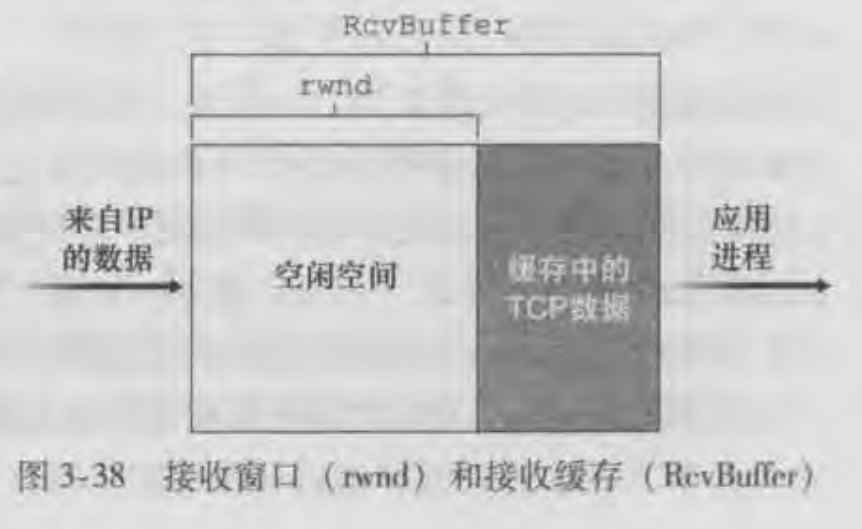
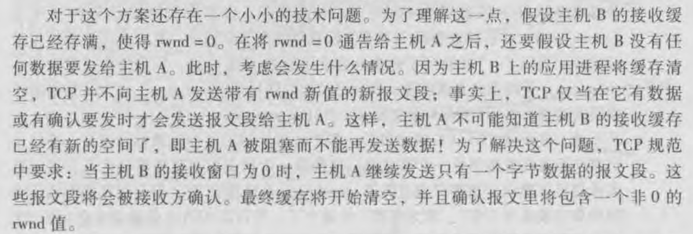

## TCP - 流量控制

TCP流量控制主要是对发送方的控制，避免发送方发送过多的报文段，而接收方来不及接收而导致的缓存溢出。

所以流量控制针对的是TCP链接的双方，对发送和接收的速率进行协调。

而**拥塞控制**针对的是网络，避免网络拥塞和网络拥塞后所采取的一系列措施。

### 接收缓存和接收窗口

在建立TCP链接时，通信的双方都会为这个链接分配**接收缓存**。当接收方收到正确、按序的字节后，它会将数据放入接收缓存中，而相关联的应用进程就可以从缓存中读取数据，但并不是数据刚一到达就立即读取。实际上接收方应用可能正忙于其他任务，甚至要过很长时间后才会读取数据，所以发送方发送的太快、太多，就有可能导致缓存溢出。

接收缓存的大小可以用一个变量代替`RevBuffer`。除此之外，我们还可以定义以下两个变量：

1. LastByteRead：表示应用进程从缓存读取的最后一个字节序号。
2. LastByteRev：表示正确接收到并放入缓存中的字节流的最后一个字节序号。

为了保证缓存不溢出，所以下面的公式必须成立
$$
LastByteRev - LastByteRead <= RevBuffer
$$
空闲的缓存空间大小
$$
rwnd = RevBuffer - (LastByteRev - LastByteRead)
$$
**rwnd表示接收窗口**，那么接收窗口的大小意味着空闲缓存区的大小。

而接收窗口的值会传递给报文段首部的窗口字段，随着确认返回给发送方。

发送方我们也定义以下两个变量：

1. LastByteSent：表示发送出去的字节流最后一个字节的序号。
2. LastByteAcked：表示已经确认的最后一个字节的序号。

所以未确认的字节大小为：
$$
LastByteSent - LastByteAcked
$$
该值必须小于rwnd的值，才不会使接收方缓存溢出。

当接收窗口的值为0时，就不允许发送方再发送数据，那就有一个问题是接收方后续不会在返回ack给到发送方，那么后续发送方就不清楚接收方的缓存是否有空闲。引入书中的原话：

我的理解是发送方会维持一个定时器，然后尝试发送一个报文段去询问窗口值大小。

所以总结就是**TCP通过维持接收窗口的大小来进行流量控制**。