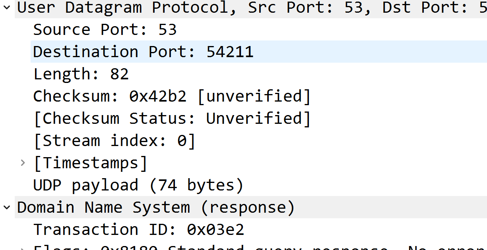

# 传输层（Transport）

传输层有两个协议

1. TCP（Transmission Control Protocol）传输控制协议
2. UDP（User Datagram Protocol）用户数据报协议

## UDP - 数据格式

UDP是无连接的，减少了建立和释放连接的开销

UDP尽最大努力交付，不保证可靠传输

因为UDP比较简单，不需要像TCP需要维护一些复杂的参数，它的首部只有8个字节

### 源端口、目的端口

各占16位

相对于客户端来说，源端口表示客户端端口，目的端口表示服务器端口

客户端端口都是临时开启的随机端口，而服务器则是固定端口，因为服务器需要一直监听某个端口接收请求

### UDP 长度

占16位，表示的是UDP数据报长度包括**首部+数据部分**

### UDP 检验和

占16位

检验和的计算内容：**伪首部 + 首部 + 数据**

需要注意伪首部仅参与检验和的计算，不会传给网络层

## TCP - 数据格式

TCP首部分为两个部分：固定首部（20字节）+ 可变首部

### TCP的几个要点

1. 可靠传输
2. 流量控制
3. 拥塞控制
4. 连接管理、建立连接、释放连接

### 源端口、目标端口

各占16位

表示客户端和服务器端端口号

### 数据偏移

占4位

数据偏移字段用来表示首部长度，**首部长度 = 数据偏移的值 * 4**

所以可变首部最大40个字节。

### 保留

占6位，目前全为0，保留以后使用。

### 检验和

占16位

跟UDP一样，TCP的校验和的计算内容：**伪首部 + 首部 + 数据**

伪首部也是12个字节，内容和UDP部分相同，也仅参与检验和的计算不会传递给网络层

### 紧急指针

占16位

表明当前数据部分存在紧急数据

### 标志位

#### URG (Urgent)

当**URG=1**时，紧急指针字段才有效，表明当前报文段中有紧急数据，应该优先传送

#### ACK (Acknowledgment)

当**ACK=1**时，确认号字段才有效

#### PSH (Push)

#### RST (Reset)

当**RST=1**时，表示连接已经出现了严重差错，必须释放连接，然后在重新建立连接。

#### SYN (Synchronization)

当**SYN=1、ACK=0**时，表示这是一个建立连接的请求

#### FIN (Finsh)

当**FIN=1**时，表示数据已经传输完成，要求释放连接

### 序号（Sequence Number）

占32位，4个字节

首先，在传输的过程中**TCP的数据部分每一个字节都会有编号**。

在建立连接后，序号代表：**这一次传输给对方的TCP数据部分的第一个字节的编号**

### 确认号（Acknowledgment Number）

占32位，4个字节

在建立连接后，确认号代表：**期望对方下一次传过来的TCP数据部分的第一个字节的编号**

表示已经接收到前多少编号的数据，希望接收的下一个数据段的开始编号是从多少开始。

## 参考

[【学习笔记】计算机网络 谢希仁版（五）运输层（重点） | 入驻第八天](https://juejin.cn/post/6990934492965765156)
