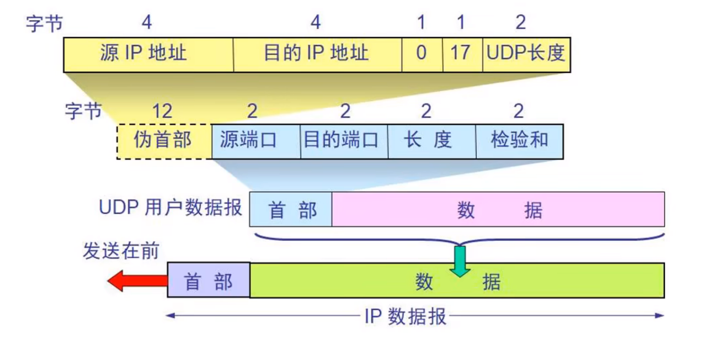
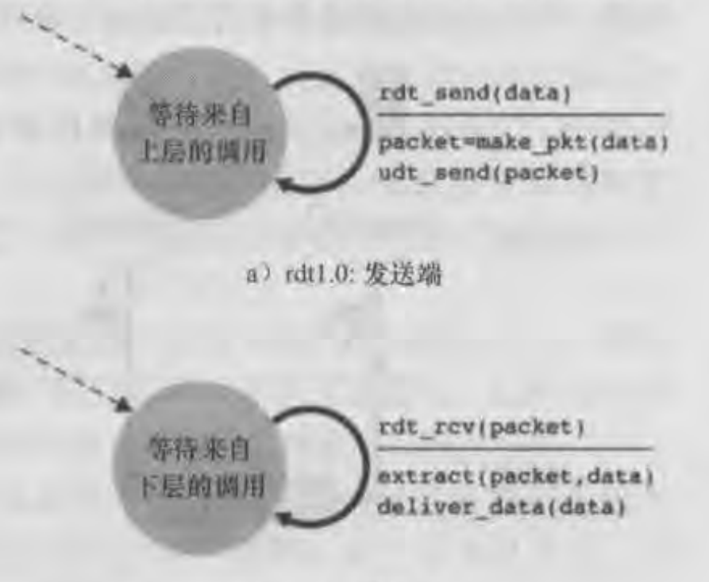
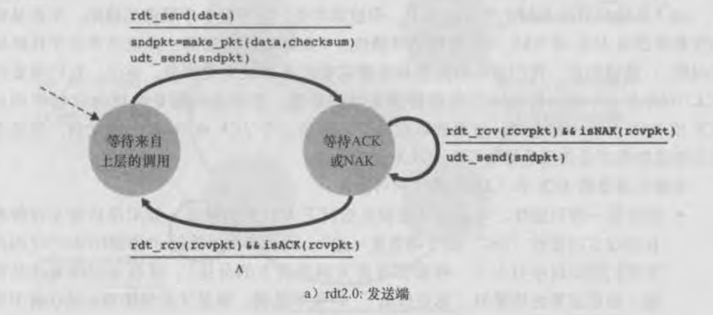
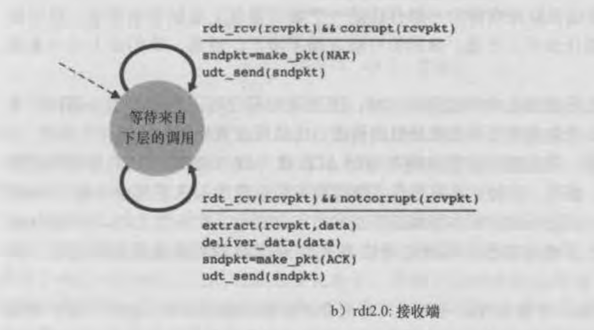
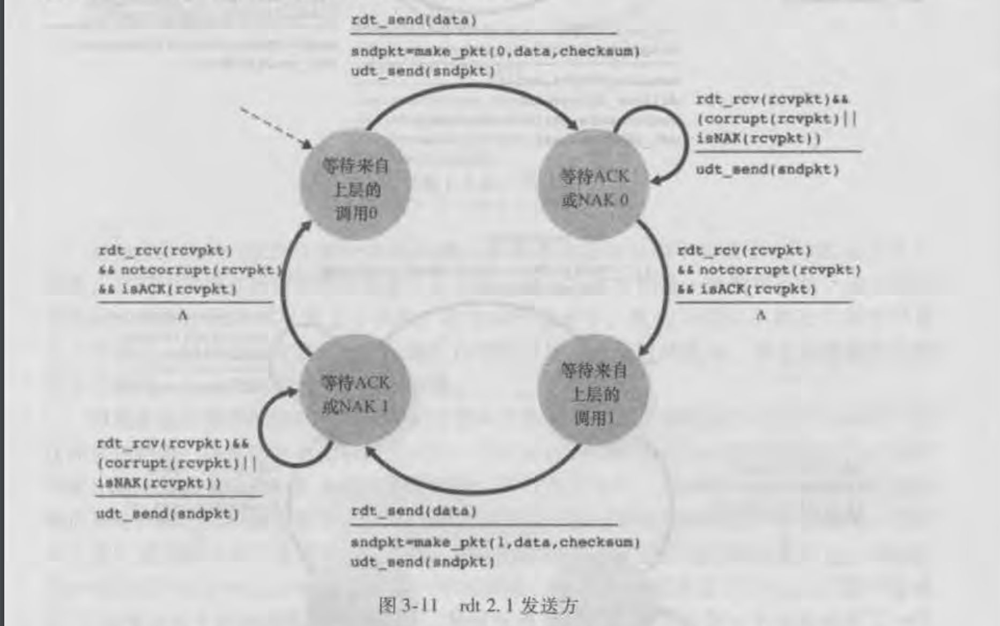
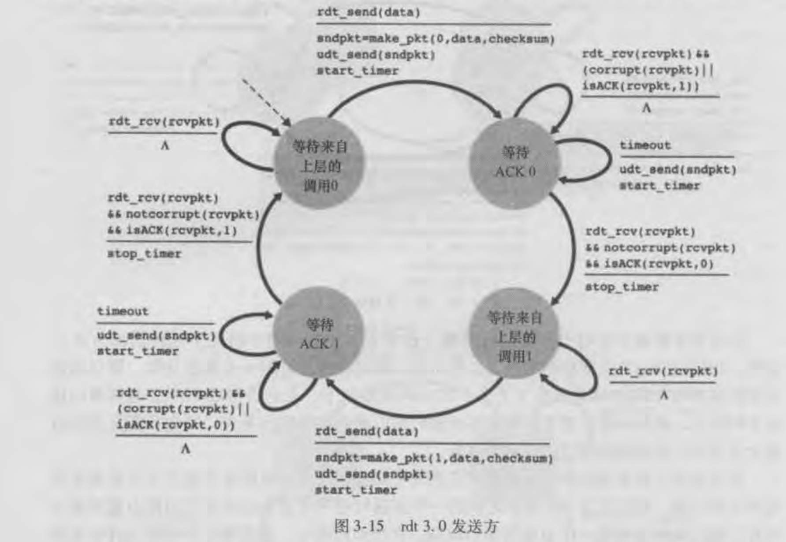

# 传输层（Transport）

传输层有两个协议

1. TCP（Transmission Control Protocol）传输控制协议
2. UDP（User Datagram Protocol）用户数据报协议

## UDP - 数据格式

UDP是无连接的，减少了建立和释放连接的开销

UDP尽最大努力交付，不保证可靠传输

因为UDP比较简单，不需要像TCP需要维护一些复杂的参数，它的首部只有8个字节

### 源端口、目的端口

各占16位

相对于客户端来说，源端口表示客户端端口，目的端口表示服务器端口

客户端端口都是临时开启的随机端口，而服务器则是固定端口，因为服务器需要一直监听某个端口接收请求

### UDP 长度

占16位，表示的是UDP数据报长度包括**首部+数据部分**

### UDP 检验和

占16位

检验和的计算内容：**伪首部 + 首部 + 数据**

需要注意伪首部仅参与检验和的计算，不会传给网络层

## TCP - 数据格式

TCP首部分为两个部分：固定首部（20字节）+ 可变首部

### TCP的几个要点

1. 可靠传输
2. 流量控制
3. 拥塞控制
4. 连接管理、建立连接、释放连接

### 源端口、目标端口

各占16位

表示客户端和服务器端端口号

### 数据偏移

占4位

数据偏移字段用来表示首部长度，**首部长度 = 数据偏移的值 * 4**

所以可变首部最大40个字节。

### 保留

占6位，目前全为0，保留以后使用。

### 检验和

占16位

跟UDP一样，TCP的校验和的计算内容：**伪首部 + 首部 + 数据**

伪首部也是12个字节，内容和UDP部分相同，也仅参与检验和的计算不会传递给网络层

### 紧急指针

占16位

表明当前数据部分存在紧急数据

### 标志位

#### URG (Urgent)

当**URG=1**时，紧急指针字段才有效，表明当前报文段中有紧急数据，应该优先传送

#### ACK (Acknowledgment)

当**ACK=1**时，确认号字段才有效

#### PSH (Push)

#### RST (Reset)

当**RST=1**时，表示连接已经出现了严重差错，必须释放连接，然后在重新建立连接。

#### SYN (Synchronization)

当**SYN=1、ACK=0**时，表示这是一个建立连接的请求

#### FIN (Finsh)

当**FIN=1**时，表示数据已经传输完成，要求释放连接

### 序号（Sequence Number）

占32位，4个字节

首先，在传输的过程中**TCP的数据部分每一个字节都会有编号**。

在建立连接后，序号代表：**这一次传输给对方的TCP数据部分的第一个字节的编号**

### 确认号（Acknowledgment Number）

占32位，4个字节

在建立连接后，确认号代表：**期望对方下一次传过来的TCP数据部分的第一个字节的编号**

表示已经接收到前多少编号的数据，希望接收的下一个数据段的开始编号是从多少开始。

## TCP - 可靠传输

### 构造可靠数据传输协议

#### 1、经完全可靠信道的可靠数据传输：rdt1.0

rdt1.0表示传输的信道是完全可靠的，可靠表示为两个方面：

1. 不出现差错：数据在信道传输不会出现差错（例如比特位反转），发送方发送了什么，接收方就接收到了什么。
2. 不丢失：在信道传输的分组不会出现丢失

因为信道是完全可靠的，所以rdt1.0协议是非常简单，只需要发送数据接收数据即可

上面是rdt1.0的有限状态机（Finite-State Machine FSM）的定义

有限状态机由三部分组成：有限状态、事件和动作

事件的触发会执行相应的动作并且进行状态的变更

可以看出rdt1.0发送方只有等待来自上层的调用一个状态，发送方通过rdt_send事件接收来自上层的数据。

然后发送方就会将数据进行打包（make_pkt）进行发送（udt_send）。

接收方通过rdt_rev事件接收来自下层传递的数据，然后进行解包获取相应的数据（extract）最后传递给上层（deliver_data）

#### 2、经具有比特差错信道的可靠数据传输：rdt2.0

rdt1.0假设是信道完全可靠，现在我们假设信道传输过程中是可能会发生比特受损，但是信道不会出现丢失的情况。

rdt2.0就需要在信道可能出现比特受损的情况下保证数据的可靠传输

实现可靠数据传输依赖于以下三种机制：

1. 差错检验：接收方有能力去发现从发送方传递过来的数据是否发生比特差错，通过首部检验和字段进行判断。
2. 接收方反馈：发送方需要知道发送的分组是否被接收方正常接收，那么需要接收方在正常接收的情况下给一个肯定确认ACK，如果接收到的分组出现了差错，就需要给一个否定确认NAK。
3. 重传：当发送方接收到一个NAK时会重传当前分组

基于重传机制的可靠数据传输协议称为**自动重传请求（Automatic Repeat reQuest）协议**

**发送方FSM：**

发送方接收来自上层数据，然后跟校验和（checksum）一起打包发送后进入到等待ACK或NAK状态，处于这个阶段时接收到了接收方的确认

如果是NAK，则重传分组保持当前状态。如果是ACK则什么都不做，回到等待上层的调用状态。

FSM中分子表示事件，分母表示事件所对应的动作，当事件或动作不存在时会使用例如A这样的标识，表示什么都不做或者没有相应的事件。

**接收方FSM：**

而在接收方需要对接收到的数据进行差错校验，如果出现了差错则需要返回一个NAK，否则解包获取数据向上传递然后在返回一个ACK。

需要注意的是：**当发送方处于等待ACK或NAK状态时，rdt_send事件是不存在的，也就是发送方不能接收上层的数据进行发送。需要等待接收到来自接收方的肯定确认回到等待来自上层调用状态时，才可以接收上层数据进行发送。**

因为这样的行为rdt2.0也被称为**停等（stop-and-wait）协议**。

#### 3、rdt2.1

但是rdt2.0存在一个致命的问题是返回的ACK或者NAK是受损的，那么发送方就无法正确知道接收方返回的确认是什么，也就是发送方无法得知接收方是否正确接收到分组。

rdt2.1的做法是**除了接收到正确的ACK外其余的（NAK或受损的）都重传当前分组**。这样就可能往信道中引入冗余的分组，而接收方的困难在于怎么知道传递过来的分组是一个新分组还是一个冗余分组。

这时就引入了**序号**的概念，发送方需要对数据分组进行编号，然后发送给接收方的分组中就需要维持一个序号的字段，然后接收方接收到这个分组就可以检查这个序号（根据接收到的序号与上一次接收到的分组序号进行比较，相同则表示重传）知道是否是一次重传。

对于停止等待协议来说，序号只需要一个比特位（0、1）就行。

而发送方也需要有检验差错的能力，对返回的确认进行差错校验。出错了就重传，没出错则根据ACK或者NAK做出相应的动作

**下面是rdt2.1发送方的FSM：**

因为引入了序号（1个比特位），所以2.1维持的状态是2.0的两倍。

与2.0大致一样，不同在于：

1. 发送的包多了一个序号的字段
2. 对于接收到的确认需要做差错校验，如果出错了则重传当前分组
3. 维持了一个序号，序号在0和1之间交换

**接收方的FSM：**

接收方处了对接收到的分组做差错校验外，还会判断接收到的分组序号是否与我等待的分组序号是一致的。如果一致则向上传递数据然后返回一个ACK。

如果序号不一致则表示这是一个重传分组，直接返回一个ACK，不会再向上传递数据，因为这个分组数据是已经接收过的。

因此通过序号让接收方知道这个分组是否是一个重传分组，如果是重传分组需要在返回一个ACK给发送方，因为上一次返回的ACK出错了，发送方不清楚接收方的一个接收情况。

#### 4、rdt2.2

rdt2.2取消了NAK，取而代之的是返回一个对上个分组序号确认的ACK，通过对上个分组序号的确认来表示对当前分组的否定。

那么发送方就需要去检查返回的ACK序号来判断对当前分组的肯定或者否定。

rdt2.2发送方增加了对返回的ACK序号的确认，如果收到的ACK序号与我等待的序号是一致的则认为是肯定确认，不一致则表示否定确认。

#### 5、经具有比特差错的丢包信道的可靠数据传输：rdt3.0

rdt2.0是在假设信道可能会出现比特差错但是不会发生丢失的情况下构造的。

现在假设除了会出现比特差错外，还会出现丢失的情况下如何保证数据的可靠传输。

rdt3.0将如何检测发生了丢包和如何恢复丢包工作都放在了发送方。

而发送方通过指定时间内是否收到ACK来判定是否丢包，如果在指定的时间内还没有收到接收方的确认，那么发送方则认为这个分组丢失了，那么在发送方就需要维持一个**倒计时定时器（countdown timer）**。

超时的几种情况：

1. 发送方到接收方的数据分组丢失了
2. 接收方到发送方的确认分组丢失了
3. 数据分组或确认分组经历了一个特别大的时延

不管什么情况发送方所采取的恢复行为是**重传**，将丢失的分组重传。

**rdt3.0发送方的FSM：**

1. 发送完数据后，会启动一个定时器**start_timer**，进入等待ACK状态
2. 等待阶段收到了对方的确认，如果确认有差错或者序号不对则不做任何事情，**等待超时**。
3. 如果等待阶段超时，则重传分组重启一个定时器
4. 如果收到的分组不管是差错和序号都没有问题则将数据传递给上层，关闭定时器进入到等待上层调用阶段，切换序号。
5. 在等待上层阶段如果收到对方的确认（在网络中经历了比较大的延迟，导致后续才收到这个确认分组）则不做任何事情，因为只有在等待确认阶段才会对接收方返回的确认进行处理，而等待上层阶段只会对上层调用进行处理。

**可以看出发送方收到不对的（比特差错或序号不对）确认分组时不会去重传分组，而是什么都不做等待超时，由超时处理去进行重传操作。**

rdt3.0是最终的**停止等待ARQ协议**

### 连续ARQ协议 + 滑动窗口协议

### 选择性确认 - SACK

SACK（Selective Acknowledgement）选择性确认

可以告诉发送方未按序到达的哪些数据是已经确认收到的，那些是丢失的。

SACK信息会放在TCP首部的可变部分。

Kind：占一个字节，值为5表示这是SACK选项

Length：占一个字节，表示SACK选项总共需要占用多少字节

Left Edge：占四个字节，左边界

Right Edge：占四个字节，右边界

首先确认号201，表示前面200个字节已经确认收到

SACK选项信息：

第一对左边界值（L1）为301，右边界（R1）值为401，表示301到 400（右边减1）这一块是确认收到的，不需要在重新传。

以此类推。

一对边界信息需要占用八个字节，还有两个固定字节。但是可变部分最大四十个字节

所以(40 - 2) / 8 = 4，最多能存取4对边界信息。

## 参考

[【学习笔记】计算机网络 谢希仁版（五）运输层（重点） | 入驻第八天](https://juejin.cn/post/6990934492965765156)
