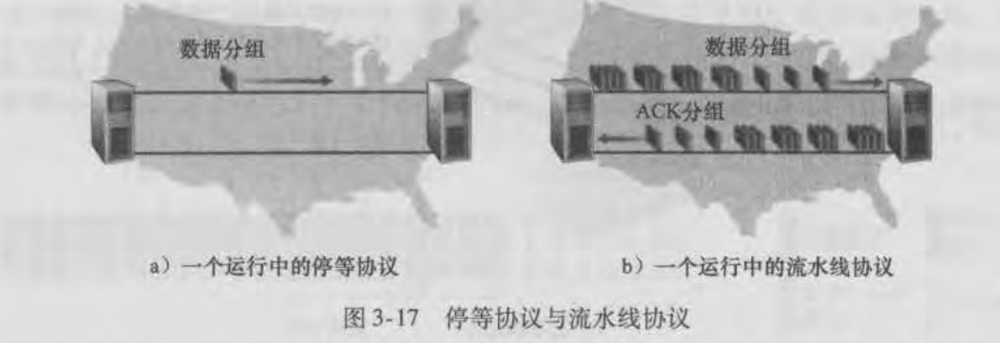
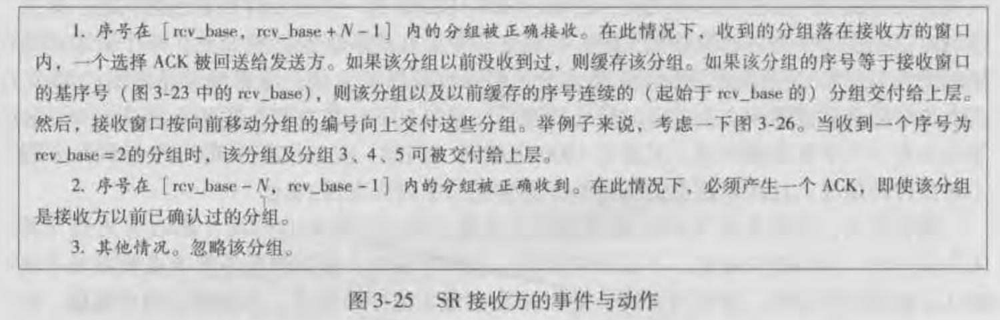

​	

## 构造可靠数据传输协议

### 1、经完全可靠信道的可靠数据传输：rdt1.0

rdt1.0表示传输的信道是完全可靠的，可靠表示为两个方面：

1. 不出现差错：数据在信道传输不会出现差错（例如比特位反转），发送方发送了什么，接收方就接收到了什么。
2. 不丢失：在信道传输的分组不会出现丢失

因为信道是完全可靠的，所以rdt1.0协议是非常简单，只需要发送数据接收数据即可

上面是rdt1.0的有限状态机（Finite-State Machine FSM）的定义

有限状态机由三部分组成：有限状态、事件和动作

事件的触发会执行相应的动作并且进行状态的变更

可以看出rdt1.0发送方只有等待来自上层的调用一个状态，发送方通过rdt_send事件接收来自上层的数据。

然后发送方就会将数据进行打包（make_pkt）进行发送（udt_send）。

接收方通过rdt_rev事件接收来自下层传递的数据，然后进行解包获取相应的数据（extract）最后传递给上层（deliver_data）

### 2、经具有比特差错信道的可靠数据传输：rdt2.0

rdt1.0假设是信道完全可靠，现在我们假设信道传输过程中是可能会发生比特受损，但是信道不会出现丢失的情况。

rdt2.0就需要在信道可能出现比特受损的情况下保证数据的可靠传输

实现可靠数据传输依赖于以下三种机制：

1. 差错检验：接收方有能力去发现从发送方传递过来的数据是否发生比特差错，通过首部检验和字段进行判断。
2. 接收方反馈：发送方需要知道发送的分组是否被接收方正常接收，那么需要接收方在正常接收的情况下给一个肯定确认ACK，如果接收到的分组出现了差错，就需要给一个否定确认NAK。
3. 重传：当发送方接收到一个NAK时会重传当前分组

基于重传机制的可靠数据传输协议称为**自动重传请求（Automatic Repeat reQuest）协议**

**发送方FSM：**

发送方接收来自上层数据，然后跟校验和（checksum）一起打包发送后进入到等待ACK或NAK状态，处于这个阶段时接收到了接收方的确认

如果是NAK，则重传分组保持当前状态。如果是ACK则什么都不做，回到等待上层的调用状态。

FSM中分子表示事件，分母表示事件所对应的动作，当事件或动作不存在时会使用例如A这样的标识，表示什么都不做或者没有相应的事件。

**接收方FSM：**

而在接收方需要对接收到的数据进行差错校验，如果出现了差错则需要返回一个NAK，否则解包获取数据向上传递然后在返回一个ACK。

需要注意的是：**当发送方处于等待ACK或NAK状态时，rdt_send事件是不存在的，也就是发送方不能接收上层的数据进行发送。需要等待接收到来自接收方的肯定确认回到等待来自上层调用状态时，才可以接收上层数据进行发送。**

因为这样的行为rdt2.0也被称为**停等（stop-and-wait）协议**。

### 3、rdt2.1

但是rdt2.0存在一个致命的问题是返回的ACK或者NAK是受损的，那么发送方就无法正确知道接收方返回的确认是什么，也就是发送方无法得知接收方是否正确接收到分组。

rdt2.1的做法是**除了接收到正确的ACK外其余的（NAK或受损的）都重传当前分组**。这样就可能往信道中引入冗余的分组，而接收方的困难在于怎么知道传递过来的分组是一个新分组还是一个冗余分组。

这时就引入了**序号**的概念，发送方需要对数据分组进行编号，然后发送给接收方的分组中就需要维持一个序号的字段，然后接收方接收到这个分组就可以检查这个序号（根据接收到的序号与上一次接收到的分组序号进行比较，相同则表示重传）知道是否是一次重传。

对于停止等待协议来说，序号只需要一个比特位（0、1）就行。

而发送方也需要有检验差错的能力，对返回的确认进行差错校验。出错了就重传，没出错则根据ACK或者NAK做出相应的动作

**下面是rdt2.1发送方的FSM：**

因为引入了序号（1个比特位），所以2.1维持的状态是2.0的两倍。

与2.0大致一样，不同在于：

1. 发送的包多了一个序号的字段
2. 对于接收到的确认需要做差错校验，如果出错了则重传当前分组
3. 维持了一个序号，序号在0和1之间交换

**接收方的FSM：**

接收方处了对接收到的分组做差错校验外，还会判断接收到的分组序号是否与我等待的分组序号是一致的。如果一致则向上传递数据然后返回一个ACK。

如果序号不一致则表示这是一个重传分组，直接返回一个ACK，不会再向上传递数据，因为这个分组数据是已经接收过的。

因此通过序号让接收方知道这个分组是否是一个重传分组，如果是重传分组需要在返回一个ACK给发送方，因为上一次返回的ACK出错了，发送方不清楚接收方的一个接收情况。

### 4、rdt2.2

rdt2.2取消了NAK，取而代之的是返回一个对上个分组序号确认的ACK，通过对上个分组序号的确认来表示对当前分组的否定。

那么发送方就需要去检查返回的ACK序号来判断对当前分组的肯定或者否定。

rdt2.2发送方增加了对返回的ACK序号的确认，如果收到的ACK序号与我等待的序号是一致的则认为是肯定确认，不一致则表示否定确认。

### 5、经具有比特差错的丢包信道的可靠数据传输：rdt3.0

rdt2.0是在假设信道可能会出现比特差错但是不会发生丢失的情况下构造的。

现在假设除了会出现比特差错外，还会出现丢失的情况下如何保证数据的可靠传输。

rdt3.0将如何检测发生了丢包和如何恢复丢包工作都放在了发送方。

而发送方通过指定时间内是否收到ACK来判定是否丢包，如果在指定的时间内还没有收到接收方的确认，那么发送方则认为这个分组丢失了，那么在发送方就需要维持一个**倒计时定时器（countdown timer）**。

超时的几种情况：

1. 发送方到接收方的数据分组丢失了
2. 接收方到发送方的确认分组丢失了
3. 数据分组或确认分组经历了一个特别大的时延

不管什么情况发送方所采取的恢复行为是**重传**，将丢失的分组重传。

**rdt3.0发送方的FSM：**

1. 发送完数据后，会启动一个定时器**start_timer**，进入等待ACK状态
2. 等待阶段收到了对方的确认，如果确认有差错或者序号不对则不做任何事情，**等待超时**。
3. 如果等待阶段超时，则重传分组重启一个定时器
4. 如果收到的分组不管是差错和序号都没有问题则将数据传递给上层，关闭定时器进入到等待上层调用阶段，切换序号。
5. 在等待上层阶段如果收到对方的确认（在网络中经历了比较大的延迟，导致后续才收到这个确认分组）则不做任何事情，因为只有在等待确认阶段才会对接收方返回的确认进行处理，而等待上层阶段只会对上层调用进行处理。

**可以看出发送方收到不对的（比特差错或序号不对）确认分组时不会去重传分组，而是什么都不做等待超时，由超时处理去进行重传操作。**

rdt3.0是最终的**停止等待ARQ协议**，以下是一些场景：

### 流水线可靠数据传输协议

rdt3.0已经完全具备了可靠数据传输的要求，唯一的问题是效率太低。

停等协议要求发送下一个分组之前需要收到上一个分组的确认。所以如图a两个主机链路之间一段时间内只有一个分组在传输，主机和链路大部分时间都是空闲的，导致性能太低。就好比一条上海到北京的公路只能有一辆车通过一样。

因此为了提高性能，就允许在没有收到上一个分组确认的情况下发送下一个分组。就如同b一样，一系列分组发送到接收方，然后这些分组的确认一并返回给发送方，就像流水线一样。

要实现流水线可靠数据传输，那么：

1. **必须增加序号范围**，在停等协议只需要一个比特位做序号就行（0和1），但是在流水线协议中因为需要向接收方发送多个分组，每个分组的序号必须唯一，所以序号的范围必须增加。如果序号的比特数是k，那么序号范围就扩大了[0，2^k-1]。
2. 协议的双方需要有缓存多个分组的能力，发送方至少要求能缓存那些已经发送但是没有收到确认的分组，因为重传需要这些分组。

流水线可靠数据传输分为两种：**回退N步（Go-Back-N,GBN）**、**选择重传（Selective Repeat,SR）**

#### 回退N步 GBN

在回退N步（GBN）协议中，允许发送方发送多个分组而不需要等待确认，但它受限于流水线中已发送但未确认分组数不能超过某个最大允许数N。

在GBN协议的序号范围，定义了几个变量：**基序号（base）、下一个序号（nextseqnum）、窗口长度 N**

base：表示最早的未确认分组的序号

nextsqeqnum：表示分送下一个分组的序号

N：允许最大的未确认分组数，在TCP中受限于流量控制和拥塞控制

所以如上图序号范围被分为四个部分：

[1，base-1]：表示已经收到确认的分组

[base，nextseqnum-1]：表示还未收到确认的分组

[nextseqnum，base+N-1]：表示允许发送的分组，如果有上层的调用，序号落在这个序号范围内就允许被发送。

[base+N,]：base+N后的序号不允许使用，也就是落在这个序号范围的分组不允许发送。

当每收到一个分组的确认base就会向前移动，导致整个窗口向前移动，所以GBN协议也被称为**滑动窗口协议**。

下面是GBN发送方的FSM图：

1. 初始化base和nextseqnum值为1，表示初始序号为1，下一个发送分组序号为1
2. 上层调用rdt_send后，判断nextseqnum值是否大于base+N，表示发送窗口是否已满，如果已满则拒绝上层发送数据，让上层过一段时间在试。在实际实现中发送方更可能缓存这些数据，而不会立即发送这些数据，等待合适的时机在发送。或者使用同步机制（一个信号或者标志）允许上层仅当窗口未满时rdt_send才允许被调用。
3. 如果未满，则会将数据、序号和检验和一起打包然后发送出去，并判断base是否等于nextseqnum，表示发送的这个分组是否是第一个发送的分组，之前已经不存在未确认的分组，如果是第一个发送的分组则启动一个定时器。nextseqnum加1为下一次分组做准备。
4. 当接收到了ACK确认时并且通过了校验，那么会将base设置为确认分组序号值加1，也就是前移一个分组。然后判断base是否等于nextseqnum，这里表示base是否已经追上了nextseqnum，追上了表示已经没有发送的分组了关闭定时器。如果没有追上重启定时器。
5. 如果收到了ACK但是没有通过校验，那么什么都不做。
6. 超时后，会将当前窗口内的所有已发送但是未确认的分组重传。

GBN 接收方的FSM图：

1. 首先初始化expectedseqnum为1表示期待接收的分组序号是1，sndpkt为序号0的ACK，用来表示如果1序号的分组没来，返回给发送方的初始ACK。
2. 接收到的分组是通过校验且序号是所期待的分组序号，那么就会解包拿取数据并传递给上层，然后将当前分组序号的确认返回给发送方，expectedseqnum值加1，期待下一个分组的到来。
3. 其他的就是未通过校验的或者到来的分组的序号不是期待的分组序号，默认都丢弃并且返回最近正确接收到的分组序号的确认。

从以上的双方的FSM描述需要注意的是：

1. 接收方的接收窗口大小为1，只会接收**按序到来的分组**，通过expectedseqnum变量控制，其余失序的分组全部丢弃。
2. 接收方会对每一个到来的分组进行确认，并且采用的是**累积确认**，累积确认指的是对当前序号分组及以前序号分组的确认。例如ACK确认的分组序号是n，表示n及n以前的所有分组都已经接收到。所以即使n的ACK丢失了，但是接收到了n+1的ACK，对发送方来说都是一样的。
3. 发送方发送了多个分组，但是只维持了**一个计时器**，这个计时器是针对最早发送但未确认分组的。
4. 但是如果计时器过时了，那么发送窗口内的所有分组都会被重新发送，而不是只有第一个分组被发送。这也是为什么接收方接收到失序分组丢弃而不缓存的原因，因为超时重传了所有的分组，在接收方就没必要去缓存失序的分组了。
5. 发送方接收到正确的分组确认时，会重新启动一个计时器为当前最早未确认分组计时。
6. **目前协议的重传都是基于超时**

以上就是GBN协议，序号为N的分组超时了，就直接回到N将N及以后所有分组重传。

**疑惑点**：GBN协议的发送方的FSM描述中返回了一个ACK，只要这个ACK通过了校验就可以重置base和计时器。但是一个场景是N序号的ACK先比N-1序号的ACK到达呢，base回到了比当前更小的值？还是就是每次收到失序分组的ACK确认后都会重置计时器？

但是不管怎样，GBN实现了流水线的可靠协议。因为就算发生了上面疑惑的场景也是可以保证可靠传输的。

场景：

#### 选择重传 SR

在GNB协议中，单个分组的差错就会引起整个发送窗口内所有分组的重传。尽管一些分组是可以被接收方接收但因为它不是按序到来而被丢弃掉，引起很多不必要的重传。可能导致信道充斥着大量不必要的分组。

选择重传SR协议**就希望让发送方有选择的重传分组（它认为在接收方出差错的分组）**，避免不必要的重传。

SR与GBN类似，它们主要的差异在于：

1. SR就不能像GBN协议一样采用累计确认，而是采用单独确认。单独确认每一个分组是否被正确接收到。
2. 单独确认需要每一个分组都设置计时器，那个分组超时就重传那个分组。
3. SR的接收方的接收窗口能接收多个分组（大于1），失序到达的分组也能被缓存下来。

发送窗口：

SR协议的发送窗口[send_base，nextseqnum-1]序号范围内可能就有失序分组的确认。

接收窗口：

接收窗口大于1，对于 失序到的分组也进行缓存并返回该分组的确认。

需要注意的是在接收方接收到一个前面已经接收到的分组时也需要返回一个ACK给发送方。因为存在一种场景就是可能返回的ACK丢失了，导致了发送方超时重传，所以需要返回一个确认给到发送方。

需要注意的是在分组2丢失后，尽管分组345都收到了确认，但是没收到2时发送窗口是不能移动的，保证发送窗口前的序号都是已确认的分组。发送方也是不能将失序的345分组交互给上层而是缓存等待按序到来的分组2，然后一起交互给上层。

