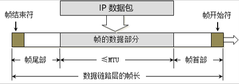
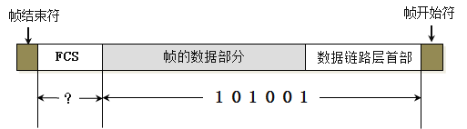

# 网络互联模型

1、为了更好的促进互联网的研究和发展，国际化标准组织ISO在1985年制定了网络互联模型。

OSI参考模型（open system Interconnect Reference Model），具有7层结构

## 传输过程

## 网络分层

## 物理层

物理层定义了接口标准、缆线标准、传输速率、传输方式等

 

例如接口的形状、大小以及线缆的材质等等。

## 数字信号、模拟信号

### 模拟信号

连续的信号、适合长距离传输

缺点：抗干扰能力差，受到干扰时波形变形很难纠正

电话线和光纤传输的就是模拟信号

### 数字信号

离散的信号，不适合长距离传输

抗干扰能力强，受到干扰时波形失真可以修复

网线传输是数字信号

## 数据通信模型

### 局域网通信模型

### 广域网通信模型

通过调制解调器进行数字信号到模拟信号的转换进行长距离传输

## 信道

信道：信息传输的通道，一条传输介质上（比如网线）上可以有多条信道

 

### 单工通信

1. 信号只能往一个方向传输，任何时候都不能改变信号的传输方向。
2. 比如无线电广播、有线电视广播

### 半双工通信

1. 信号可以双向传输，但是必须交替进行，同一时间只能往一个方向传输。
2. 比如对讲机

### 全双工通信

1. 信号可以同时双向传输
2. 比如手机等

 

## 数据链路层

### 链路

从一个节点到相邻节点的一段物理线路（有线或者无线），中间没有任何其他交换节点

### 数据链路

在一条链路上传输数据时，需要对应的通信协议来控制数据的传输。

不同类型的数据链路，所用的通信协议可能是不同的。

1. 广播信道；CSMA/CD协议（比如同轴线缆、集线器等组成的网络）
2. 点对点信道：PPP协议（比如两个路由之间的信道）

数据链路层的三个基本问题

1. 封装成帧
2. 透明传输
3. 差错校验

### 封装成帧

封装成帧 (framing) 就是在IP数据包的前后分别添加首部和尾部，然后就构成了一个帧。

首部和尾部的一个重要作用就是进行帧定界。

帧的数据部分：就是网络层传递下来的数据包

 

最大传输单元MTU（Maximum Transfer Unit）

每一种数据链路层协议都规定了所能够传输的帧的数据长度上限。

以太网（局域网）的MTU为1500字节

### 透明传输

使用SOH（Start Of Header）作为帧开始符
使用EOT（End Of Transmission）作为帧结束符

数据部分一旦出现SOH、EOT，就需要进行转义（ESC）

使用ESC字符进行转义，如果数据部分也出现了ESC转义字符，还需要通过ESC对其进行转义

### 差错检验

 

在数据后面添加上的冗余码称为帧检验序列 FCS (Frame Check Sequence)。

 FCS是根据数据部分 + 首部计算得出的，数据传输前和传输后都会计算FCS用来检验数据是否出错。如果出错则会被网卡抛弃。

### CSMA/CD协议

CSMA/CD（Carrier Sense Multiple Access with Collision Detectio）载波侦听多路访问/冲突检测

1. “多路”表示许多计算机以多点接入的方式连接在一根总线上。
2. “载波监听”是指每一个站在发送数据之前先要检测一下总线上是否有其他计算机在发送数据，如果有，则暂时不要发送数据，以免发生碰撞。总线上并没有什么“载波”。因此， “载波监听”就是用电子技术检测总线上有没有其他计算机发送的数据信号。
3. “碰撞检测”就是计算机边发送数据边检测信道上的信号电压大小。当几个站同时在总线上发送数据时，总线上的信号电压摆动值将会增大（互相叠加）。当一个站检测到的信号电压摆动值超过一定的门限值时，就认为总线上至少有两个站同时在发送数据，表明产生了碰撞。所谓“碰撞”就是发生了冲突。因此“碰撞检测”也称为“冲突检测”。

在发生碰撞时，总线上传输的信号产生了严重的失真，无法从中恢复出有用的信息来。

每一个正在发送数据的站，一旦发现总线上出现了碰撞，就要立即停止发送，免得继续浪费网络资源，然后等待一段随机时间后再次发送。

使用了CSMA/CD的网络可以称为是以太网（Ethernet），它传输的是以太网帧

 

 

 

 

 

 

## 参考

[大哥笔记](https://www.cnblogs.com/wkfvawl/p/15519671.html)