# 网络层（Network）

## 简介

网络层数据包（IP数据包、Packet），由首部和数据两部分组成。

数据：数据部分是由上层传输层传递下来的数据段。

首部：首部为IP协议添加的额外信息，分为固定部分和可变部分。

​	固定部分为协议所规定的通信过程中肯定存在的字段部分，为20个字节。

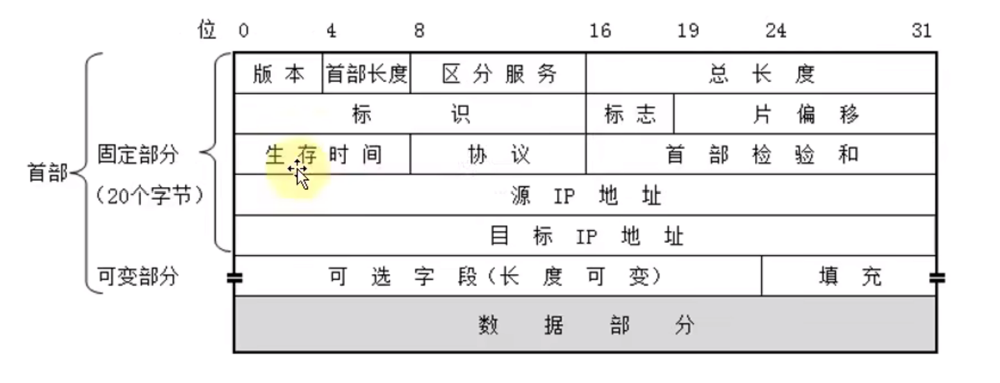

## 首部

### 1、版本（Version）

版本字段占4个二进制位，用来表示当前使用的IP协议版本，例如IP4、IP6

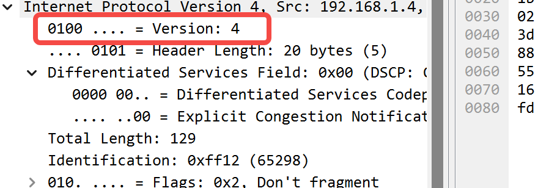

### 2、首部长度

首部长度字段占4个二进制位，表示当前IP数据包首部占用长度，包括固定首部和可变首部长度。

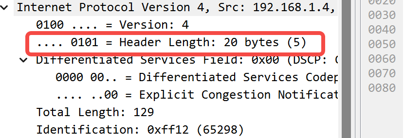

首部长度计算：**长度 = 二进制值 * 4**

如上，**0101**二进制值为5，所以这个IP数据包的首部长度为20字节

**最小值**：固定部分长度20字节

最大值：**1111**值为15，所以最大值为60字节，也就是说可变部分最大值为40字节。

### 3、区分服务

区分服务字段占8个二进制位，主要用来通过区分不同服务，提高服务质量。

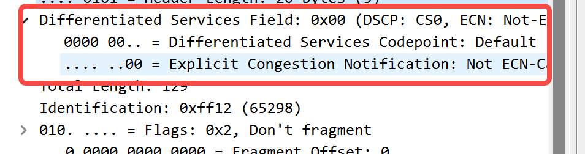

### 4、总长度（Total Length）

总长度字段占16个二进制位也就是两个字节，用来表示整个IP数据包的大小（长度）。

包括首部和数据部分，总体长度。

最大值：**2^16=65535**字节

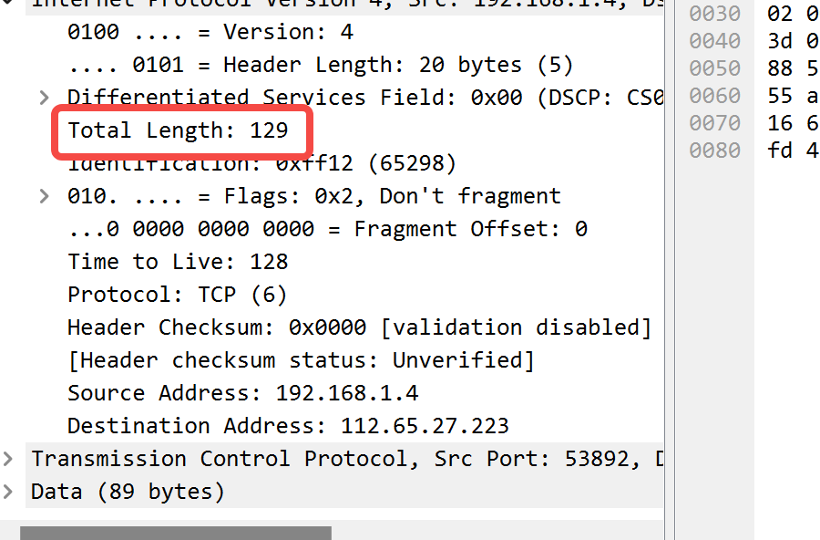

在以太网中由于帧的数据部分不能超过1500字节，每个链路层协议都会规定自己的MTU（最大传输单元）。

所以过大的IP数据包，需要进行分片然后传输给数据链路层。

每一片都会有自己的网络层首部。

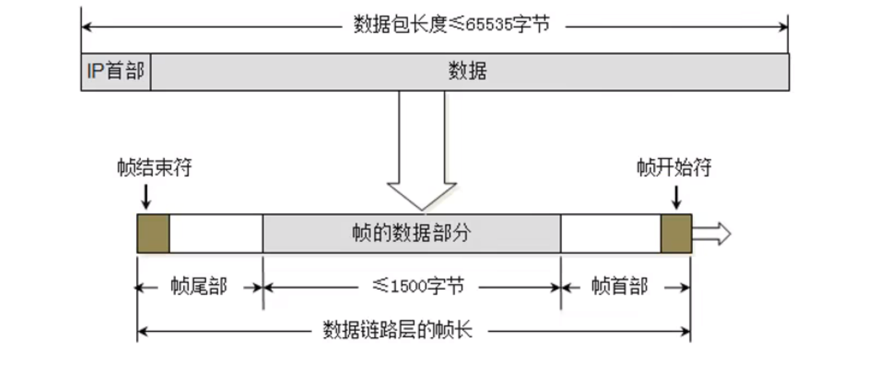

### 5、标识（Identification）

标识字段占16个二进制位，是该IP数据包的ID也就是唯一标识，用来标识该数据包的。

当数据包过大进行分片时，同一个数据包的所有片的标识都是一样的。

有一个计数器专门管理数据包ID，每发出一个数据包ID加1，当超过最大值65535时，自动从0开始。

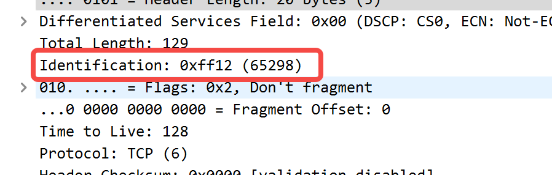

### 6、标志（Flags）

占3位。

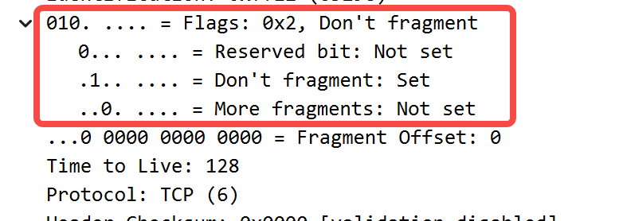

第一位（Reserved bit）：保留位

第二位（Don't fragment）：1代表不允许分片，0代表允许分片

第三位（More fragment）：1代表不是最后一片，0代表是最后一片

### 7、片偏移（Fragment Offets）

占13位。

片偏移乘以8等于字节偏移，也就是说片偏移的值乘以8后才是真正的字节偏移。

字节偏移指的是每一片中数据部分第一个字节相对于整个数据的偏移。如下图：

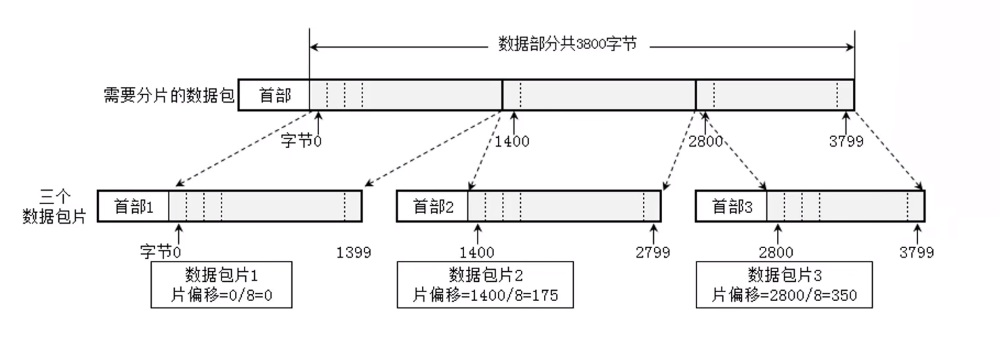

每一片数据部分长度都是8的整数倍

乘以8的原因：因为IP数据包总长度最大是16位，而13位的片偏移是不足以指定16位数据包的所有偏移值。补充3位后就一定能百分百覆盖整个数据包的所有字节。

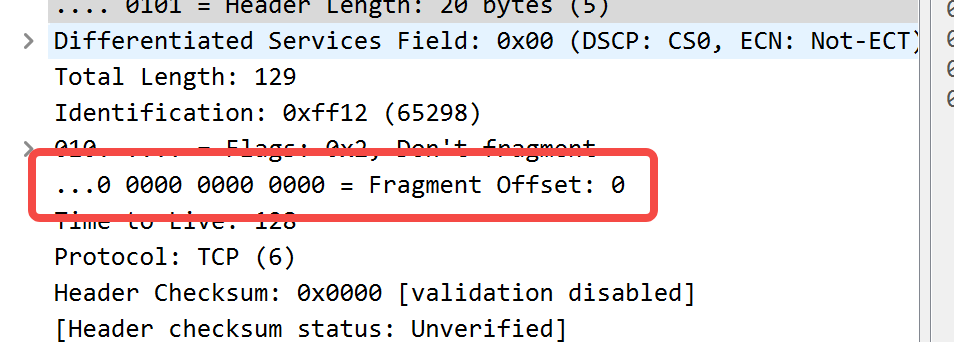

#### 总结：

1、通过标识来确定多个帧是否是同一个IP数据包。

2、通过片偏移将同属于一个数据包的片进行组合。第一片值为0，第二片等于总长度减去首部长度得到数据部分长度

该值就是字节偏移值，除以8后在所有片中找寻片偏移等于该值的片。

3、通过标志知道那一片是最后一片，标志整个IP数据包组合完成。

#### 实践：

通过ping 命令发送指定大小的数据包

```bash
ping qq.com -l 4000
```

结果：

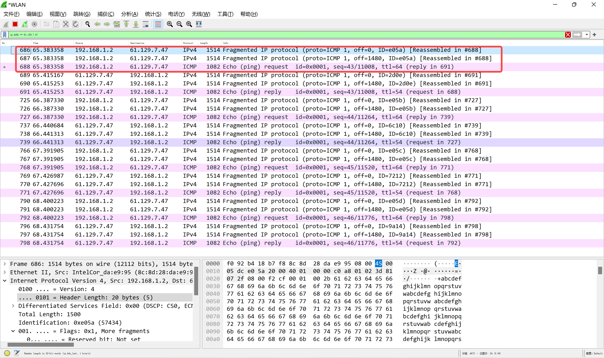

ping 命令一共发送了四次数据，每次分成三片进行传输。

##### 第一片：

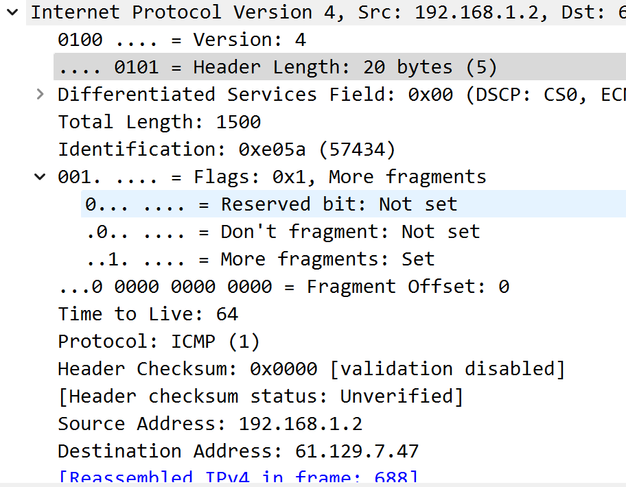

第一片总长度1500字节，首部20字节数据部分占1480字节。

标识为57434，片偏移0，标志Don't fragment为0表示允许分片，More fragments为1表示还有更多片，不是最后一片。

找寻下一片，片偏移为1480。

##### 第二片：

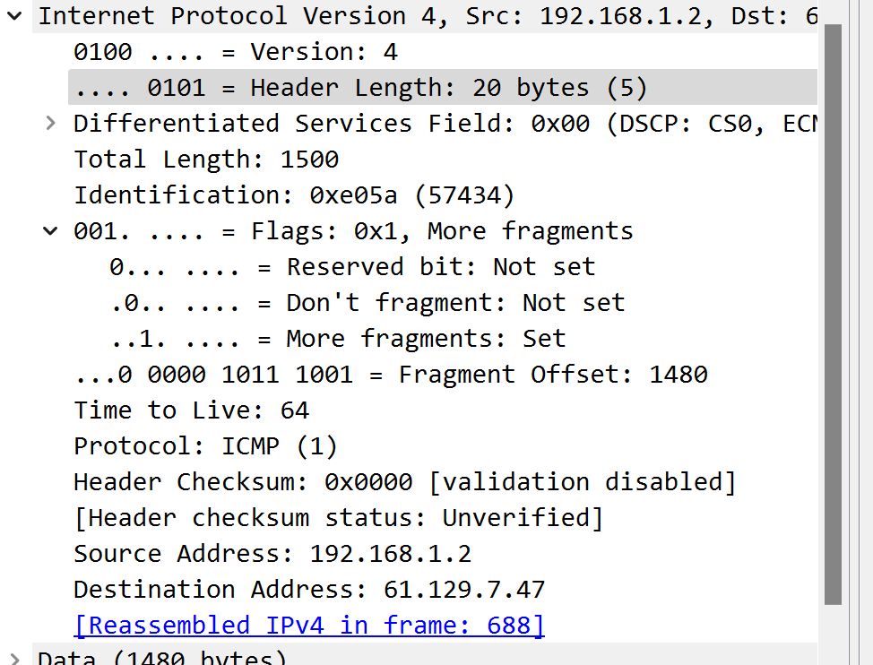

##### 第三片：

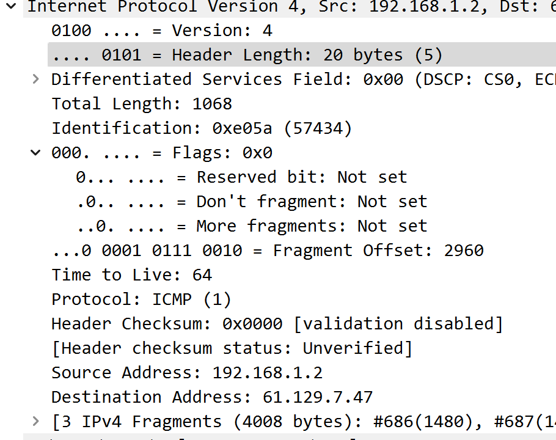

第三片More fragments标志位就被设置为0，表示这是最后一片。

所以4000字节被分为1480、1480和1040三片进行传输。

### 8、生存时间（Time To Live,TTL）

占8位

每个路由器在转发IP数据包之前会将TTL减1，大于0时则会进行下一步转发，但是一旦发现TTL的值为0，路由器则会返回错误报告。

所以TTL表示这个IP数据包所允许经过的路由器数量，大于则会被抛弃并返回错误。

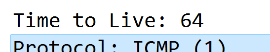

通过以下命令进行测试

```bash
ping baidu.com -i TTL
```

**当指定TTL为1时：**

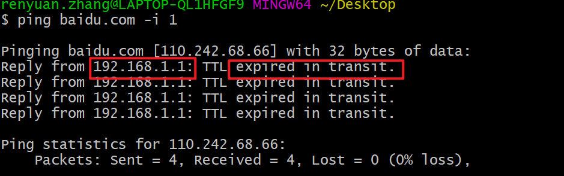

可以看出报错显示在**传输过程中过期**，而且这个错误是由**内网网关返回的**，因为将IP数据包发送给内网网关时，内网网关在进行转发之前会对TTL进行减1发现值为0后，网关就会返回报错。

**当指定为2时：**

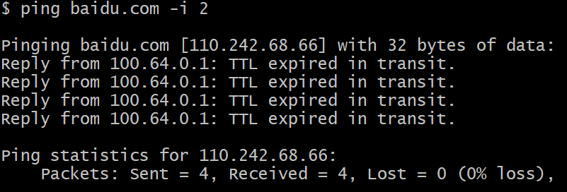

发现返回报错信息的路由器IP变了。

### 9、协议（Protocol）

占8位

表示IP数据包的数据部分所使用的协议

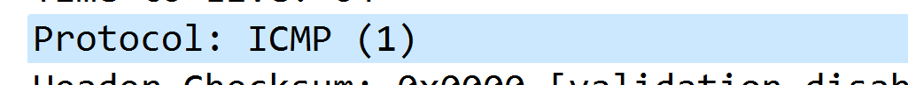

根据协议字段可以将数据部分交由相对应的协议进行处理

### 10、首部检验和（Header Checksum）

占16位

首先它会对首部进行一个计算得到一个值填充到首部检验和中，接收方拿到这个值时、

它也会用相同的计算方法对首部进行一个计算得到一个值，然后两个值进行比较判断首部是否被修改


### 11、源IP、目标IP

各占32位，4个字节

表示当前主机和目标主机ip地址


