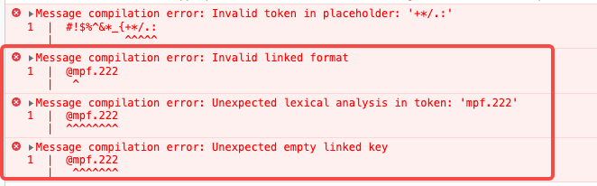

## vue-i18n 目前是在版本9发现错误

### 报错截图：

### 原因分析：

@符在多语言信息中是一个特殊字符，在vue-i18n官网中就说明@被用来链接其他多语言信息[linked-locale-messages](https://kazupon.github.io/vue-i18n/zh/guide/messages.html#linked-locale-messages)

它正确的格式应该是“@:”，所以第一条报错无效的格式，以及第二三条无法进行正确的解析，如果是使用了“@:”格式，还需要注意链接的路径必须是完整的多语言路径。不然第三条还是会报错。

目前发现多语言信息中特殊字符包括：@、{ 、} 

### 解决方法

避免直接使用@，使用{'@'}进行替代。

以上特殊字符都可以采用该方法进行展示。
