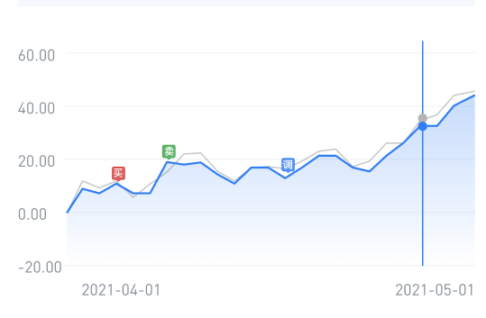

## 1、ios 中 input 的type值为number是不起效果的

解决方法：

不使用number类型，改用text类型

1）使用pattern属性，pattern=[0-9]*，只能有数字，没有小数点

2）参考vant input，发现inputmode属性，使用decimal表示小数键盘

https://developer.mozilla.org/zh-CN/docs/Web/HTML/Global_attributes/inputmode

## 2、dialog弹窗时，触摸mask或者dialog时，不允许页面滚动

给dialog组件容器添加touchmove事件，并阻止默认事件

代码：

 const maskEle = document.querySelector('.common-dialog');
      maskEle.addEventListener(
        'touchmove',
        function(e) {
          e.preventDefault();
        },
        { passive: false }
      );
   });

需要注意在window、document和body中添加touchmove等事件阻止默认事件需要额外加上{ passive: false }

## 3、接口返回状态为0，表示什么

> 查看axios -> status 0

## 4、折线图定制标记线和标记点

### 1）点击或者触摸折线图显示定制标记线

好处：

1、坐标轴指示器，不管是直线指示器还是十字指示器，在移动指示器的时候，可以移出折线图外，不能固定在折线图的左右两端

2、十字指示器的yAxis那根线是跟随手势去上下移动的，也就是十字指示器的交点不会在折线上，导致指示器的label展示的值不对

3、使用定制标记线替代指示器可以避免出现以上的问题

代码；

// 点击折线图时，绘制标记线

// mousedown和mousemove代码一样

// mouseup 需要取消标记线

第一段：

```javascript
      myEcharts.getZr().on('mousedown', function (param) {
          // 获取 点击的 触发点像素坐标
          const pointInPixel = [param.offsetX, param.offsetY];
          // 判断给定的点是否在指定的坐标系或者系列上
          if (myEcharts.containPixel('grid', pointInPixel)) {
            // 获取到点击的 x轴 下标  转换为逻辑坐标
            let xIndex = myEcharts.convertFromPixel(
              { seriesIndex: 0 },
              pointInPixel
            )[0];
            // 做一些其他事情
            // console.log(xIndex);
            markLineConfig.data[1].yAxis = dataY[xIndex];
            markLineConfig.data[0].xAxis = String(dataX[xIndex]);
            option.series[0]['markLine'] = markLineConfig;
            // debugger;
            myEcharts.setOption({
              ...option,
              animation: false,
            });
          }
        });
```

第二段：

```javascript
        // 隐藏标记线
        myEcharts.getZr().on('mouseup', function () {
          myEcharts.clear();
          console.log('mouseup');
          delete option.series[0]['markLine'];
          myEcharts.setOption({
            ...option,
            animation: false,
          });
        });
```

第三段：

```javascript
        // 标记线配置
        let markLineConfig = {
          symbol: 'none',
          animation: false,
          precision: 2,
          lineStyle: {
            borderWidth: 1,
            lineStyle: {
              type: 'dashed',
              color: '#DE2121',
              width: 1,
            },
          },
          label: {
            // textStyle: {
            fontSize: 10,
            color: '#fff',
            padding: 2,
            backgroundColor: '#DE2121',
            // },
          },
          emphasis: {
            // 设置鼠标点上去不让其线条变粗
            lineStyle: {
              width: 1,
            },
          },
          data: [
            {
              xAxis: '20211209',
              label: {
                position: 'start',
                formatter: function (params) {
                  //   debugger;
                  let value = String(params.value);
                  const year = value.substring(0, 4);
                  const month = value.substring(4, 6);
                  const day = value.substring(6, 8);
                  return `${year}-${month}-${day}`;
                },
              },
            },
            {
              yAxis: -0.014796,
              label: {
                position: 'start',
                formatter: function (params) {
                  //   debugger;
                  let value = params.value;
                  return formatNum(value);
                },
              },
            },
          ],
        };
```

### 总结：

整体思路：是根据mousedown和mousemove事件获取到用户触摸到x,y像素坐标，再根据echarts提供的api接口，echarts实例对象上的converFromPixel方法将像素坐标，转换为逻辑坐标索引，根据索引去xAxis和yAxis的data中拿取相应的值，在根据拿到的x值画竖线，y值画横线。

### 2）定制标记点

场景：收益走势图常常需要标记加仓、赎回和调仓等等地方，而且样式不是简单的标记点，如下：



代码：

```javascript
  // 需要先绘图，不然convertToPixel 坐标无法匹配相应像素值
  chart.clear();
  chart.setOption(chartOption);
  // 交易类型对应的icon
  const tradingTypeMap = {
    1: adjustIcon,
    2: addIcon,
    3: sellIcon,
    4: sellIcon,
    6: addIcon,
  };
  if (tradingPoint.length) {
    tradingPoint.forEach((pIt) => {
      // 通过接口获取的标记点，获取相应的坐标，痛殴坐标获取相应的像素值
      const grid1 = chart.convertToPixel({ seriesIndex: 0 }, [
        String(xData[pIt.index]),
        yData1[pIt.index],
      ]);
      // 设置标记点的位置，因为标记点事居中显示的，所以需要向上偏移50%
      this.markPointData.push({
        x: grid1[0],
        y: grid1[1],
        symbol: `image://${tradingTypeMap[pIt.type]}`, //标记点icon
        symbolSize: [10, 12],
        symbolOffset: [0, '-50%'],
      });
      chart.clear();
      chart.setOption(chartOption);
    });
  }
```

### 5、canvas中设置字体无效

canvas中使用自定义字体时，不生效

可能原因：在canvas在绘制时，字体文件还未加载成功

解决：保证字体文件加载完成后，在绘制cancas

尝试：在canvas前使用该字体（目前使用是生效的）

链接：[canvas字体设置无效](https://www.jianshu.com/p/9a350b2bf4f9)

### 6、安卓webview本身就不支持pdf预览

Android的webview压根就不支持加载pdf。

Android与iOS不同，iOS加载pdf，不管本地还是在线，直接使用webview渲染就可以了，而Android却做不到。

链接：[安卓webview加载pdf](https://cloud.tencent.com/developer/article/1899292)

解决：目前是借助pdfjs插件去加载pdf，然后通过页面的iframe内嵌pdf

缺点：如果是在线的pdf可能存在着跨域问题