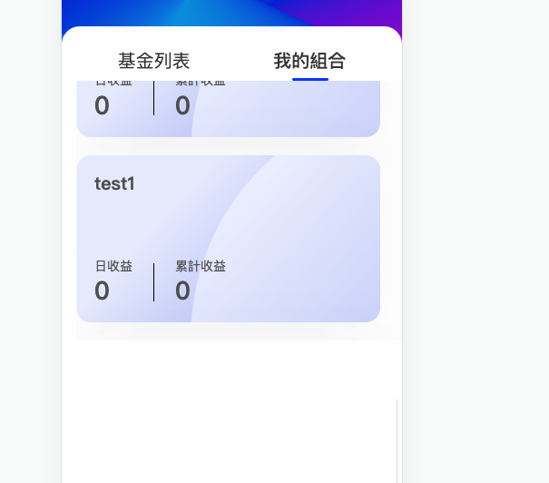

## 现象

一个长列表下滑滚动时，列表中的内容需要等待一段时间才会渲染出来，但是其实列表元素都是已经存在的，不是动态添加渲染的。

而且页面滚动到列表下方，在滚回列表上方时，列表上方的内容也会重新渲染卡顿。



## 原因

经过排查是css样式问题：

```css
filter: drop-shadow(0px 9px 28px rgba(48, 58, 79, 0.04))
    drop-shadow(0px 12px 48px rgba(48, 58, 79, 0.02));
  backdrop-filter: blur(2px);
```

具体原因待查
